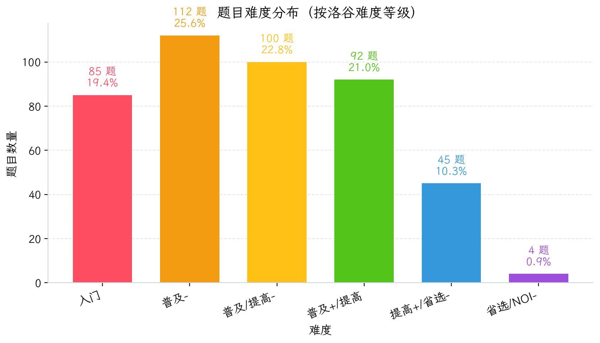
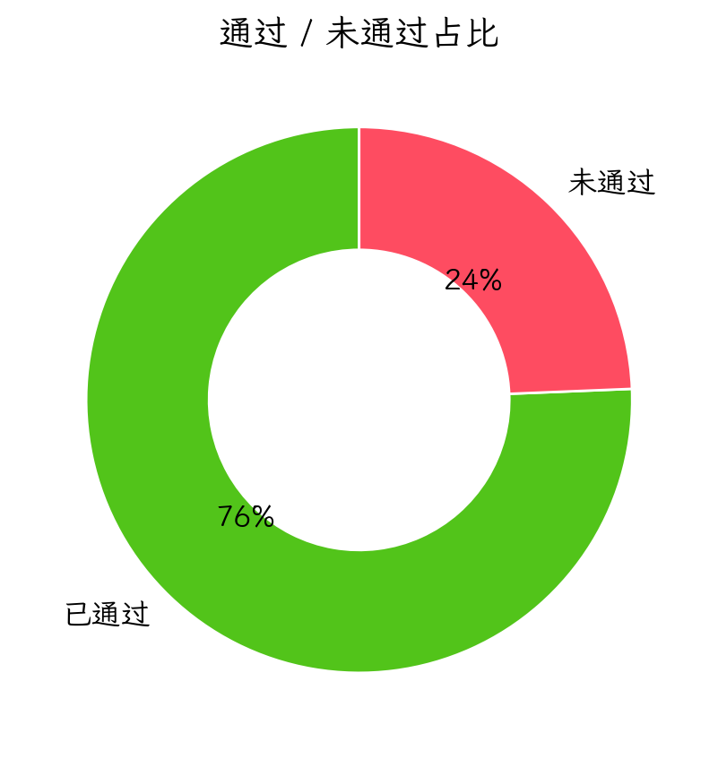

# 信息学奥赛选手深度诊断报告

## 数据校准与真实统计
- 报告生成时间：2026-06-04 01:17

### 难度分布（程序生成）
<table><thead><tr><th>洛谷难度</th><th>题数</th><th>占比</th><th>分布图</th></tr></thead><tbody>
<tr><td><span style="display:inline-block;padding:2px 10px;border-radius:6px;background:#FE4C61;color:#fff;font-weight:600;">入门</span></td><td>85</td><td>19.4%</td><td><span style="display:inline-block;width:150px;height:12px;background:#E5E7EB;border-radius:9999px;overflow:hidden;vertical-align:middle;"><span style="display:block;width:19.4%;height:12px;background:#FE4C61;"></span></span> <span style="margin-left:8px;">19.4%</span></td></tr>
<tr><td><span style="display:inline-block;padding:2px 10px;border-radius:6px;background:#F39C12;color:#fff;font-weight:600;">普及-</span></td><td>112</td><td>25.6%</td><td><span style="display:inline-block;width:150px;height:12px;background:#E5E7EB;border-radius:9999px;overflow:hidden;vertical-align:middle;"><span style="display:block;width:25.6%;height:12px;background:#F39C12;"></span></span> <span style="margin-left:8px;">25.6%</span></td></tr>
<tr><td><span style="display:inline-block;padding:2px 10px;border-radius:6px;background:#FFC116;color:#fff;font-weight:600;">普及/提高-</span></td><td>100</td><td>22.8%</td><td><span style="display:inline-block;width:150px;height:12px;background:#E5E7EB;border-radius:9999px;overflow:hidden;vertical-align:middle;"><span style="display:block;width:22.8%;height:12px;background:#FFC116;"></span></span> <span style="margin-left:8px;">22.8%</span></td></tr>
<tr><td><span style="display:inline-block;padding:2px 10px;border-radius:6px;background:#52C41A;color:#fff;font-weight:600;">普及+/提高</span></td><td>92</td><td>21.0%</td><td><span style="display:inline-block;width:150px;height:12px;background:#E5E7EB;border-radius:9999px;overflow:hidden;vertical-align:middle;"><span style="display:block;width:21.0%;height:12px;background:#52C41A;"></span></span> <span style="margin-left:8px;">21.0%</span></td></tr>
<tr><td><span style="display:inline-block;padding:2px 10px;border-radius:6px;background:#3498DB;color:#fff;font-weight:600;">提高+/省选-</span></td><td>45</td><td>10.3%</td><td><span style="display:inline-block;width:150px;height:12px;background:#E5E7EB;border-radius:9999px;overflow:hidden;vertical-align:middle;"><span style="display:block;width:10.3%;height:12px;background:#3498DB;"></span></span> <span style="margin-left:8px;">10.3%</span></td></tr>
<tr><td><span style="display:inline-block;padding:2px 10px;border-radius:6px;background:#9D4EDD;color:#fff;font-weight:600;">省选/NOI-</span></td><td>4</td><td>0.9%</td><td><span style="display:inline-block;width:150px;height:12px;background:#E5E7EB;border-radius:9999px;overflow:hidden;vertical-align:middle;"><span style="display:block;width:0.9%;height:12px;background:#9D4EDD;"></span></span> <span style="margin-left:8px;">0.9%</span></td></tr>
<tr><td><span style="display:inline-block;padding:2px 10px;border-radius:6px;background:#0E1D69;color:#fff;font-weight:600;">NOI/NOI+/CTSC</span></td><td>0</td><td>0.0%</td><td><span style="display:inline-block;width:150px;height:12px;background:#E5E7EB;border-radius:9999px;overflow:hidden;vertical-align:middle;"><span style="display:block;width:0.0%;height:12px;background:#0E1D69;"></span></span> <span style="margin-left:8px;">0.0%</span></td></tr>
</tbody></table>

### 知识点覆盖统计表（按算法标签）
<table><thead><tr><th>级别</th><th>已覆盖/总数</th><th>覆盖率</th><th>掌握度分布</th></tr></thead><tbody>
<tr><td><strong>入门</strong></td><td>22/28</td><td>78.6%</td><td><span style="display:inline-block;padding:1px 8px;border-radius:6px;background:#14532D;color:#fff;font-size:11px;font-weight:600;margin-right:4px;">精通 9项</span><span style="display:inline-block;padding:1px 8px;border-radius:6px;background:#166534;color:#fff;font-size:11px;font-weight:600;margin-right:4px;">熟练 5项</span><span style="display:inline-block;padding:1px 8px;border-radius:6px;background:#16A34A;color:#fff;font-size:11px;font-weight:600;margin-right:4px;">入门 6项</span><span style="display:inline-block;padding:1px 8px;border-radius:6px;background:#86EFAC;color:#064E3B;border:1px solid #4ADE80;font-size:11px;font-weight:600;margin-right:4px;">初窥 2项</span><span style="display:inline-block;padding:1px 8px;border-radius:6px;background:#FFFFFF;color:#6B7280;border:1px solid #9CA3AF;font-size:11px;font-weight:600;margin-right:4px;">空白 6项</span></td></tr>
<tr><td><strong>提高</strong></td><td>27/50</td><td>54.0%</td><td><span style="display:inline-block;padding:1px 8px;border-radius:6px;background:#14532D;color:#fff;font-size:11px;font-weight:600;margin-right:4px;">精通 4项</span><span style="display:inline-block;padding:1px 8px;border-radius:6px;background:#166534;color:#fff;font-size:11px;font-weight:600;margin-right:4px;">熟练 1项</span><span style="display:inline-block;padding:1px 8px;border-radius:6px;background:#16A34A;color:#fff;font-size:11px;font-weight:600;margin-right:4px;">入门 12项</span><span style="display:inline-block;padding:1px 8px;border-radius:6px;background:#86EFAC;color:#064E3B;border:1px solid #4ADE80;font-size:11px;font-weight:600;margin-right:4px;">初窥 10项</span><span style="display:inline-block;padding:1px 8px;border-radius:6px;background:#FFFFFF;color:#6B7280;border:1px solid #9CA3AF;font-size:11px;font-weight:600;margin-right:4px;">空白 23项</span></td></tr>
<tr><td><strong>省选</strong></td><td>7/10</td><td>70.0%</td><td><span style="display:inline-block;padding:1px 8px;border-radius:6px;background:#14532D;color:#fff;font-size:11px;font-weight:600;margin-right:4px;">精通 0项</span><span style="display:inline-block;padding:1px 8px;border-radius:6px;background:#166534;color:#fff;font-size:11px;font-weight:600;margin-right:4px;">熟练 1项</span><span style="display:inline-block;padding:1px 8px;border-radius:6px;background:#16A34A;color:#fff;font-size:11px;font-weight:600;margin-right:4px;">入门 2项</span><span style="display:inline-block;padding:1px 8px;border-radius:6px;background:#86EFAC;color:#064E3B;border:1px solid #4ADE80;font-size:11px;font-weight:600;margin-right:4px;">初窥 4项</span><span style="display:inline-block;padding:1px 8px;border-radius:6px;background:#FFFFFF;color:#6B7280;border:1px solid #9CA3AF;font-size:11px;font-weight:600;margin-right:4px;">空白 3项</span></td></tr>
<tr><td><strong>NOI</strong></td><td>11/43</td><td>25.6%</td><td><span style="display:inline-block;padding:1px 8px;border-radius:6px;background:#14532D;color:#fff;font-size:11px;font-weight:600;margin-right:4px;">精通 0项</span><span style="display:inline-block;padding:1px 8px;border-radius:6px;background:#166534;color:#fff;font-size:11px;font-weight:600;margin-right:4px;">熟练 0项</span><span style="display:inline-block;padding:1px 8px;border-radius:6px;background:#16A34A;color:#fff;font-size:11px;font-weight:600;margin-right:4px;">入门 5项</span><span style="display:inline-block;padding:1px 8px;border-radius:6px;background:#86EFAC;color:#064E3B;border:1px solid #4ADE80;font-size:11px;font-weight:600;margin-right:4px;">初窥 6项</span><span style="display:inline-block;padding:1px 8px;border-radius:6px;background:#FFFFFF;color:#6B7280;border:1px solid #9CA3AF;font-size:11px;font-weight:600;margin-right:4px;">空白 32项</span></td></tr>
</tbody></table>

- 口径说明：
  - 行 = 级别（入门/提高/省选/NOI），列 = 已覆盖/总数、覆盖率、**掌握度分布**。
  - **掌握度分布**展示该级别下所有知识点 topic 按掌握度 5 档（精通/熟练/入门/初窥/空白）的分布，颜色用绿色深浅：精通近黑→熟练深绿→入门标准绿→初窥浅绿→空白白。
  - 与前一列的对应：精通 + 熟练 + 入门 + 初窥 = “已覆盖”（AC ≥ 1）；空白 = “未覆盖”（AC = 0）；5 档合计 = “总数”。
- 备注：本表只根据题目的算法标签评估知识点覆盖，表示“接触过”，不等于“熟练掌握”。

## 掌握度判定标准（5 档）
<table><thead><tr><th>掌握度</th><th>判定标准（AC 题目数）</th><th>颜色图例</th></tr></thead><tbody>
<tr><td><strong>精通</strong></td><td>AC ≥ 20 道</td><td><span style="display:inline-block;padding:2px 12px;border-radius:6px;background:#14532D;color:#FFFFFF;border:1px solid #052E16;font-size:12px;font-weight:600;">精通</span></td></tr>
<tr><td><strong>熟练</strong></td><td>10 ≤ AC ≤ 19</td><td><span style="display:inline-block;padding:2px 12px;border-radius:6px;background:#166534;color:#FFFFFF;border:1px solid #14532D;font-size:12px;font-weight:600;">熟练</span></td></tr>
<tr><td><strong>入门</strong></td><td>3  ≤ AC ≤ 9</td><td><span style="display:inline-block;padding:2px 12px;border-radius:6px;background:#16A34A;color:#FFFFFF;border:1px solid #166534;font-size:12px;font-weight:600;">入门</span></td></tr>
<tr><td><strong>初窥</strong></td><td>1  ≤ AC ≤ 2</td><td><span style="display:inline-block;padding:2px 12px;border-radius:6px;background:#86EFAC;color:#064E3B;border:1px solid #4ADE80;font-size:12px;font-weight:600;">初窥</span></td></tr>
<tr><td><strong>空白</strong></td><td>AC = 0（警示色：未接触该知识点）</td><td><span style="display:inline-block;padding:2px 12px;border-radius:6px;background:#FFFFFF;color:#6B7280;border:1px solid #9CA3AF;font-size:12px;font-weight:600;">空白</span></td></tr>
</tbody></table>
- 口径说明：5 档阈值是『知识点覆盖统计表』中『掌握度分布』列的统一判定标准；AC = 实际通过的题目数（去重）；『空白』档使用灰色警示色，提示该知识点未接触。

<div style="page-break-before:always;margin-top:24px;">
<h2 style="font-size:1.45rem;font-weight:700;color:#065F46;border-bottom:3px solid #10B981;padding-bottom:8px;margin:18px 0 12px 0;">🌳 知识树图谱（按算法标签 · 掌握度可视化）</h2>

<p style="color:#6B7280;font-size:14px;margin:6px 0 14px 0;">下图按 4 个竞赛级别（CSP-J / CSP-S / 省选 / NOI）展示所有考纲知识点的掌握度。果子**大小 + 颜色**都按"掌握度"用绿色深浅表示（精通近黑 / 熟练深绿 / 入门绿 / 初窥浅绿 / 空白白）。把鼠标悬停在果子上可查看 AC 题目数、掌握等级与关联题目的难度。</p>
<div class="kt-section" style="margin:8px 0 18px 0;"><h2 style="font-size:18px;font-weight:700;color:#065F46;border-left:5px solid #10B981;padding:6px 0 6px 10px;margin:0 0 8px 0;background:#F0FDF4;border-radius:0 6px 6px 0;">🌳 知识树图谱（按竞赛级别 · 果子大小/颜色 = 掌握度）</h2><p style="font-size:12px;color:#4B5563;margin:0 0 10px 0;line-height:1.6;">下图为按 4 个竞赛级别（CSP-J / CSP-S / 省选 / NOI）分别画出的 4 棵"知识树"。每棵树上，<b>主干</b>代表该级别，<b>分支</b>代表算法分类（基础实现 / 搜索 · DFS / 动态规划 / 贪心 · 二分 / 图论 / 数据结构 / 字符串 / 数学 · 数论 / 计算几何 / 其他），<b>果子</b>就是该分类下的具体知识点。<b>果子越大、颜色越深</b> = 该知识点 AC 数越多 = 掌握越好；灰色小果子 = 该知识点尚未接触（AC=0）。</p><div style="background:#F9FAFB;border:1px solid #E5E7EB;border-radius:6px;padding:10px 14px;margin:0 0 14px 0;font-size:11px;color:#374151;"><div style="display:flex;flex-wrap:wrap;align-items:center;gap:6px;"><span style="font-weight:700;color:#1F2937;margin-right:6px;">� 果子大小 + 颜色 = 掌握度（绿色深浅：精通近黑→熟练深绿→入门标准绿→初窥浅绿→空白白）</span><span style="display:inline-flex;align-items:center;gap:5px;margin-right:12px;"><svg width="40" height="40" viewBox="-20 -20 40 40" xmlns="http://www.w3.org/2000/svg"><circle r="18" fill="#14532D" stroke="#052E16" stroke-width="1.2"/><ellipse cx="-5.76" cy="-7.20" rx="6.30" ry="3.96" fill="#FFFFFF" opacity="0.5"/></svg><span style="font-size:11px;color:#1F2937;">精通</span></span><span style="display:inline-flex;align-items:center;gap:5px;margin-right:12px;"><svg width="34" height="34" viewBox="-17 -17 34 34" xmlns="http://www.w3.org/2000/svg"><circle r="15" fill="#166534" stroke="#14532D" stroke-width="1.2"/><ellipse cx="-4.80" cy="-6.00" rx="5.25" ry="3.30" fill="#FFFFFF" opacity="0.5"/></svg><span style="font-size:11px;color:#1F2937;">熟练</span></span><span style="display:inline-flex;align-items:center;gap:5px;margin-right:12px;"><svg width="28" height="28" viewBox="-14 -14 28 28" xmlns="http://www.w3.org/2000/svg"><circle r="12" fill="#16A34A" stroke="#166534" stroke-width="1.2"/><ellipse cx="-3.84" cy="-4.80" rx="4.20" ry="2.64" fill="#FFFFFF" opacity="0.5"/></svg><span style="font-size:11px;color:#1F2937;">入门</span></span><span style="display:inline-flex;align-items:center;gap:5px;margin-right:12px;"><svg width="22" height="22" viewBox="-11 -11 22 22" xmlns="http://www.w3.org/2000/svg"><circle r="9" fill="#86EFAC" stroke="#4ADE80" stroke-width="1.2"/><ellipse cx="-2.88" cy="-3.60" rx="3.15" ry="1.98" fill="#FFFFFF" opacity="0.5"/></svg><span style="font-size:11px;color:#1F2937;">初窥</span></span><span style="display:inline-flex;align-items:center;gap:5px;margin-right:12px;"><svg width="18" height="18" viewBox="-9 -9 18 18" xmlns="http://www.w3.org/2000/svg"><circle r="7" fill="#FFFFFF" stroke="#9CA3AF" stroke-width="1.2"/><ellipse cx="-2.24" cy="-2.80" rx="2.45" ry="1.54" fill="#FFFFFF" opacity="0.5"/></svg><span style="font-size:11px;color:#1F2937;">空白</span></span></div></div><div class="kt-tree-block" style="margin:0 0 8px 0;padding:0;"><div style="display:flex;justify-content:space-between;align-items:baseline;border-bottom:2px solid #10B981;padding:0 0 5px 0;margin:0 0 4px 0;"><span style="font-size:14px;font-weight:700;color:#065F46;">🌱 CSP-J 入门 · 知识树</span><span style="font-size:11px;color:#6B7280;">已点亮 <b style="color:#059669;font-weight:700;">22</b> / 28（78.6%）</span></div><svg viewBox="0 0 680 674" width="100%" height="auto" preserveAspectRatio="xMidYMid meet" xmlns="http://www.w3.org/2000/svg" style="display:block;max-width:100%;margin:0 auto;" font-family="-apple-system, BlinkMacSystemFont, 'PingFang SC', 'Microsoft YaHei', sans-serif">
<defs><linearGradient id="sky_CSP" x1="0" y1="0" x2="0" y2="1"><stop offset="0" stop-color="#F0FDF4"/><stop offset="1" stop-color="#FFFFFF"/></linearGradient></defs>
<rect x="0" y="0" width="680" height="38" fill="url(#sky_CSP)"/>
<line x1="0" y1="36" x2="680" y2="36" stroke="#A89878" stroke-width="1.5" stroke-dasharray="2 3"/>
<line x1="8" y1="36" x2="6" y2="41" stroke="#86EFAC" stroke-width="1.2"/>
<line x1="30" y1="36" x2="28" y2="41" stroke="#86EFAC" stroke-width="1.2"/>
<line x1="52" y1="36" x2="50" y2="41" stroke="#86EFAC" stroke-width="1.2"/>
<line x1="74" y1="36" x2="72" y2="41" stroke="#86EFAC" stroke-width="1.2"/>
<line x1="96" y1="36" x2="94" y2="41" stroke="#86EFAC" stroke-width="1.2"/>
<line x1="118" y1="36" x2="116" y2="41" stroke="#86EFAC" stroke-width="1.2"/>
<line x1="140" y1="36" x2="138" y2="41" stroke="#86EFAC" stroke-width="1.2"/>
<line x1="162" y1="36" x2="160" y2="41" stroke="#86EFAC" stroke-width="1.2"/>
<line x1="184" y1="36" x2="182" y2="41" stroke="#86EFAC" stroke-width="1.2"/>
<line x1="206" y1="36" x2="204" y2="41" stroke="#86EFAC" stroke-width="1.2"/>
<line x1="228" y1="36" x2="226" y2="41" stroke="#86EFAC" stroke-width="1.2"/>
<line x1="250" y1="36" x2="248" y2="41" stroke="#86EFAC" stroke-width="1.2"/>
<line x1="272" y1="36" x2="270" y2="41" stroke="#86EFAC" stroke-width="1.2"/>
<line x1="294" y1="36" x2="292" y2="41" stroke="#86EFAC" stroke-width="1.2"/>
<line x1="316" y1="36" x2="314" y2="41" stroke="#86EFAC" stroke-width="1.2"/>
<line x1="338" y1="36" x2="336" y2="41" stroke="#86EFAC" stroke-width="1.2"/>
<line x1="360" y1="36" x2="358" y2="41" stroke="#86EFAC" stroke-width="1.2"/>
<line x1="382" y1="36" x2="380" y2="41" stroke="#86EFAC" stroke-width="1.2"/>
<line x1="404" y1="36" x2="402" y2="41" stroke="#86EFAC" stroke-width="1.2"/>
<line x1="426" y1="36" x2="424" y2="41" stroke="#86EFAC" stroke-width="1.2"/>
<line x1="448" y1="36" x2="446" y2="41" stroke="#86EFAC" stroke-width="1.2"/>
<line x1="470" y1="36" x2="468" y2="41" stroke="#86EFAC" stroke-width="1.2"/>
<line x1="492" y1="36" x2="490" y2="41" stroke="#86EFAC" stroke-width="1.2"/>
<line x1="514" y1="36" x2="512" y2="41" stroke="#86EFAC" stroke-width="1.2"/>
<line x1="536" y1="36" x2="534" y2="41" stroke="#86EFAC" stroke-width="1.2"/>
<line x1="558" y1="36" x2="556" y2="41" stroke="#86EFAC" stroke-width="1.2"/>
<line x1="580" y1="36" x2="578" y2="41" stroke="#86EFAC" stroke-width="1.2"/>
<line x1="602" y1="36" x2="600" y2="41" stroke="#86EFAC" stroke-width="1.2"/>
<line x1="624" y1="36" x2="622" y2="41" stroke="#86EFAC" stroke-width="1.2"/>
<line x1="646" y1="36" x2="644" y2="41" stroke="#86EFAC" stroke-width="1.2"/>
<line x1="668" y1="36" x2="666" y2="41" stroke="#86EFAC" stroke-width="1.2"/>
<path d="M 340 662 C 341.5 491.4 338.5 210.6 340 40" stroke="#3F2410" stroke-width="18" fill="none" stroke-linecap="round"/>
<path d="M 340 662 C 341.5 491.4 338.5 210.6 340 40" stroke="#6B4423" stroke-width="13" fill="none" stroke-linecap="round"/>
<path d="M 340 662 C 341.5 491.4 338.5 210.6 340 40" stroke="#A07A50" stroke-width="6" fill="none" stroke-linecap="round" opacity="0.55"/>
<ellipse cx="328" cy="36" rx="9" ry="6.75" fill="#4ADE80" opacity="0.85"/>
<ellipse cx="325.30" cy="33.30" rx="3.15" ry="1.80" fill="#FFFFFF" opacity="0.45"/>
<ellipse cx="350" cy="32" rx="11" ry="8.25" fill="#4ADE80" opacity="0.85"/>
<ellipse cx="346.70" cy="28.70" rx="3.85" ry="2.20" fill="#FFFFFF" opacity="0.45"/>
<ellipse cx="338" cy="24" rx="10" ry="7.50" fill="#4ADE80" opacity="0.85"/>
<ellipse cx="335.00" cy="21.00" rx="3.50" ry="2.00" fill="#FFFFFF" opacity="0.45"/>
<ellipse cx="356" cy="40" rx="7" ry="5.25" fill="#4ADE80" opacity="0.85"/>
<ellipse cx="353.90" cy="37.90" rx="2.45" ry="1.40" fill="#FFFFFF" opacity="0.45"/>
<ellipse cx="324" cy="41" rx="7" ry="5.25" fill="#4ADE80" opacity="0.85"/>
<ellipse cx="321.90" cy="38.90" rx="2.45" ry="1.40" fill="#FFFFFF" opacity="0.45"/>
<path d="M 347 90.42857142857143 Q 416.5 68.42857142857143 486 89.42857142857143" stroke="#5C3A1E" stroke-width="6" fill="none" stroke-linecap="round"/>
<path d="M 347 90.42857142857143 Q 416.5 68.42857142857143 486 89.42857142857143" stroke="#8B7355" stroke-width="3" fill="none" stroke-linecap="round" opacity="0.7"/>
<rect x="354" y="56.42857142857143" width="52" height="16" rx="8" fill="#1F2937" opacity="0.92"/>
<text x="380.0" y="68.42857142857143" font-size="10" font-weight="700" fill="#FFFFFF" text-anchor="middle">动态规划</text>
<line x1="362" y1="106.42857142857143" x2="362" y2="110.42857142857143" stroke="#5C3A1E" stroke-width="1.5"/>
<circle cx="362" cy="88.42857142857143" r="18" fill="#14532D" stroke="#052E16" stroke-width="1.4"><title>DP基础 · AC 93 · 精通 · 难度[未知]</title></circle>
<ellipse cx="356.24" cy="81.23" rx="6.30" ry="3.96" fill="#FFFFFF" opacity="0.5"/>
<text x="362" y="92.42857142857143" font-size="12" font-weight="700" fill="#FFFFFF" text-anchor="middle">93</text>
<text x="362" y="118.42857142857143" font-size="8.5" font-weight="600" fill="#1F2937" text-anchor="middle">DP基础</text>
<line x1="418" y1="103.42857142857143" x2="418" y2="107.42857142857143" stroke="#5C3A1E" stroke-width="1.5"/>
<circle cx="418" cy="88.42857142857143" r="15" fill="#166534" stroke="#14532D" stroke-width="1.4"><title>背包DP · AC 11 · 熟练 · 难度[未知]</title></circle>
<ellipse cx="413.20" cy="82.43" rx="5.25" ry="3.30" fill="#FFFFFF" opacity="0.5"/>
<text x="418" y="92.42857142857143" font-size="11" font-weight="700" fill="#FFFFFF" text-anchor="middle">11</text>
<text x="418" y="115.42857142857143" font-size="8.5" font-weight="600" fill="#1F2937" text-anchor="middle">背包DP</text>
<line x1="474" y1="95.42857142857143" x2="474" y2="99.42857142857143" stroke="#5C3A1E" stroke-width="1.5"/>
<circle cx="474" cy="88.42857142857143" r="7" fill="#FFFFFF" stroke="#9CA3AF" stroke-width="1.4"><title>区间DP · AC 0 · 空白 · 难度[未知]</title></circle>
<ellipse cx="471.76" cy="85.63" rx="2.45" ry="1.54" fill="#FFFFFF" opacity="0.5"/>
<text x="474" y="107.42857142857143" font-size="8.5" font-weight="600" fill="#1F2937" text-anchor="middle">区间DP</text>
<path d="M 333 177.28571428571428 Q 226.53333333333333 155.28571428571428 120.06666666666666 176.28571428571428" stroke="#5C3A1E" stroke-width="6" fill="none" stroke-linecap="round"/>
<path d="M 333 177.28571428571428 Q 226.53333333333333 155.28571428571428 120.06666666666666 176.28571428571428" stroke="#8B7355" stroke-width="3" fill="none" stroke-linecap="round" opacity="0.7"/>
<rect x="274" y="143.28571428571428" width="52" height="16" rx="8" fill="#1F2937" opacity="0.92"/>
<text x="300.0" y="155.28571428571428" font-size="10" font-weight="700" fill="#FFFFFF" text-anchor="middle">基础实现</text>
<line x1="318.0" y1="193.28571428571428" x2="318.0" y2="197.28571428571428" stroke="#5C3A1E" stroke-width="1.5"/>
<circle cx="318.0" cy="175.28571428571428" r="18" fill="#14532D" stroke="#052E16" stroke-width="1.4"><title>模拟法 · AC 73 · 精通 · 难度[未知]</title></circle>
<ellipse cx="312.24" cy="168.09" rx="6.30" ry="3.96" fill="#FFFFFF" opacity="0.5"/>
<text x="318.0" y="179.28571428571428" font-size="12" font-weight="700" fill="#FFFFFF" text-anchor="middle">73</text>
<text x="318.0" y="205.28571428571428" font-size="8.5" font-weight="600" fill="#1F2937" text-anchor="middle">模拟法</text>
<line x1="271.51666666666665" y1="193.28571428571428" x2="271.51666666666665" y2="197.28571428571428" stroke="#5C3A1E" stroke-width="1.5"/>
<circle cx="271.51666666666665" cy="175.28571428571428" r="18" fill="#14532D" stroke="#052E16" stroke-width="1.4"><title>排序 · AC 35 · 精通 · 难度[未知]</title></circle>
<ellipse cx="265.76" cy="168.09" rx="6.30" ry="3.96" fill="#FFFFFF" opacity="0.5"/>
<text x="271.51666666666665" y="179.28571428571428" font-size="12" font-weight="700" fill="#FFFFFF" text-anchor="middle">35</text>
<text x="271.51666666666665" y="205.28571428571428" font-size="8.5" font-weight="600" fill="#1F2937" text-anchor="middle">排序</text>
<line x1="225.03333333333333" y1="193.28571428571428" x2="225.03333333333333" y2="197.28571428571428" stroke="#5C3A1E" stroke-width="1.5"/>
<circle cx="225.03333333333333" cy="175.28571428571428" r="18" fill="#14532D" stroke="#052E16" stroke-width="1.4"><title>枚举法 · AC 33 · 精通 · 难度[未知]</title></circle>
<ellipse cx="219.27" cy="168.09" rx="6.30" ry="3.96" fill="#FFFFFF" opacity="0.5"/>
<text x="225.03333333333333" y="179.28571428571428" font-size="12" font-weight="700" fill="#FFFFFF" text-anchor="middle">33</text>
<text x="225.03333333333333" y="205.28571428571428" font-size="8.5" font-weight="600" fill="#1F2937" text-anchor="middle">枚举法</text>
<line x1="178.55" y1="190.28571428571428" x2="178.55" y2="194.28571428571428" stroke="#5C3A1E" stroke-width="1.5"/>
<circle cx="178.55" cy="175.28571428571428" r="15" fill="#166534" stroke="#14532D" stroke-width="1.4"><title>递推法 · AC 14 · 熟练 · 难度[未知]</title></circle>
<ellipse cx="173.75" cy="169.29" rx="5.25" ry="3.30" fill="#FFFFFF" opacity="0.5"/>
<text x="178.55" y="179.28571428571428" font-size="11" font-weight="700" fill="#FFFFFF" text-anchor="middle">14</text>
<text x="178.55" y="202.28571428571428" font-size="8.5" font-weight="600" fill="#1F2937" text-anchor="middle">递推法</text>
<line x1="132.06666666666666" y1="187.28571428571428" x2="132.06666666666666" y2="191.28571428571428" stroke="#5C3A1E" stroke-width="1.5"/>
<circle cx="132.06666666666666" cy="175.28571428571428" r="12" fill="#16A34A" stroke="#166534" stroke-width="1.4"><title>进制转换 · AC 6 · 入门 · 难度[未知]</title></circle>
<ellipse cx="128.23" cy="170.49" rx="4.20" ry="2.64" fill="#FFFFFF" opacity="0.5"/>
<text x="132.06666666666666" y="179.28571428571428" font-size="11" font-weight="600" fill="#FFFFFF" text-anchor="middle">6</text>
<text x="132.06666666666666" y="199.28571428571428" font-size="8.5" font-weight="600" fill="#1F2937" text-anchor="middle">进制转换</text>
<path d="M 347 264.14285714285717 Q 416.5 242.14285714285717 486 263.14285714285717" stroke="#5C3A1E" stroke-width="6" fill="none" stroke-linecap="round"/>
<path d="M 347 264.14285714285717 Q 416.5 242.14285714285717 486 263.14285714285717" stroke="#8B7355" stroke-width="3" fill="none" stroke-linecap="round" opacity="0.7"/>
<rect x="354" y="230.14285714285717" width="61" height="16" rx="8" fill="#1F2937" opacity="0.92"/>
<text x="384.5" y="242.14285714285717" font-size="10" font-weight="700" fill="#FFFFFF" text-anchor="middle">贪心/二分</text>
<line x1="362" y1="280.14285714285717" x2="362" y2="284.14285714285717" stroke="#5C3A1E" stroke-width="1.5"/>
<circle cx="362" cy="262.14285714285717" r="18" fill="#14532D" stroke="#052E16" stroke-width="1.4"><title>贪心法 · AC 68 · 精通 · 难度[未知]</title></circle>
<ellipse cx="356.24" cy="254.94" rx="6.30" ry="3.96" fill="#FFFFFF" opacity="0.5"/>
<text x="362" y="266.14285714285717" font-size="12" font-weight="700" fill="#FFFFFF" text-anchor="middle">68</text>
<text x="362" y="292.14285714285717" font-size="8.5" font-weight="600" fill="#1F2937" text-anchor="middle">贪心法</text>
<line x1="418" y1="280.14285714285717" x2="418" y2="284.14285714285717" stroke="#5C3A1E" stroke-width="1.5"/>
<circle cx="418" cy="262.14285714285717" r="18" fill="#14532D" stroke="#052E16" stroke-width="1.4"><title>二分法 · AC 48 · 精通 · 难度[未知]</title></circle>
<ellipse cx="412.24" cy="254.94" rx="6.30" ry="3.96" fill="#FFFFFF" opacity="0.5"/>
<text x="418" y="266.14285714285717" font-size="12" font-weight="700" fill="#FFFFFF" text-anchor="middle">48</text>
<text x="418" y="292.14285714285717" font-size="8.5" font-weight="600" fill="#1F2937" text-anchor="middle">二分法</text>
<line x1="474" y1="274.14285714285717" x2="474" y2="278.14285714285717" stroke="#5C3A1E" stroke-width="1.5"/>
<circle cx="474" cy="262.14285714285717" r="12" fill="#16A34A" stroke="#166534" stroke-width="1.4"><title>倍增法 · AC 8 · 入门 · 难度[未知]</title></circle>
<ellipse cx="470.16" cy="257.34" rx="4.20" ry="2.64" fill="#FFFFFF" opacity="0.5"/>
<text x="474" y="266.14285714285717" font-size="11" font-weight="600" fill="#FFFFFF" text-anchor="middle">8</text>
<text x="474" y="286.14285714285717" font-size="8.5" font-weight="600" fill="#1F2937" text-anchor="middle">倍增法</text>
<path d="M 333 351.0 Q 206.51999999999998 329.0 80.03999999999999 350.0" stroke="#5C3A1E" stroke-width="6" fill="none" stroke-linecap="round"/>
<path d="M 333 351.0 Q 206.51999999999998 329.0 80.03999999999999 350.0" stroke="#8B7355" stroke-width="3" fill="none" stroke-linecap="round" opacity="0.7"/>
<rect x="286" y="317.0" width="40" height="16" rx="8" fill="#1F2937" opacity="0.92"/>
<text x="306.0" y="329.0" font-size="10" font-weight="700" fill="#FFFFFF" text-anchor="middle">其他</text>
<line x1="318.0" y1="367.0" x2="318.0" y2="371.0" stroke="#5C3A1E" stroke-width="1.5"/>
<circle cx="318.0" cy="349.0" r="18" fill="#14532D" stroke="#052E16" stroke-width="1.4"><title>前缀和 · AC 36 · 精通 · 难度[未知]</title></circle>
<ellipse cx="312.24" cy="341.80" rx="6.30" ry="3.96" fill="#FFFFFF" opacity="0.5"/>
<text x="318.0" y="353.0" font-size="12" font-weight="700" fill="#FFFFFF" text-anchor="middle">36</text>
<text x="318.0" y="379.0" font-size="8.5" font-weight="600" fill="#1F2937" text-anchor="middle">前缀和</text>
<line x1="272.808" y1="367.0" x2="272.808" y2="371.0" stroke="#5C3A1E" stroke-width="1.5"/>
<circle cx="272.808" cy="349.0" r="18" fill="#14532D" stroke="#052E16" stroke-width="1.4"><title>队列 · AC 27 · 精通 · 难度[未知]</title></circle>
<ellipse cx="267.05" cy="341.80" rx="6.30" ry="3.96" fill="#FFFFFF" opacity="0.5"/>
<text x="272.808" y="353.0" font-size="12" font-weight="700" fill="#FFFFFF" text-anchor="middle">27</text>
<text x="272.808" y="379.0" font-size="8.5" font-weight="600" fill="#1F2937" text-anchor="middle">队列</text>
<line x1="227.61599999999999" y1="367.0" x2="227.61599999999999" y2="371.0" stroke="#5C3A1E" stroke-width="1.5"/>
<circle cx="227.61599999999999" cy="349.0" r="18" fill="#14532D" stroke="#052E16" stroke-width="1.4"><title>差分 · AC 26 · 精通 · 难度[未知]</title></circle>
<ellipse cx="221.86" cy="341.80" rx="6.30" ry="3.96" fill="#FFFFFF" opacity="0.5"/>
<text x="227.61599999999999" y="353.0" font-size="12" font-weight="700" fill="#FFFFFF" text-anchor="middle">26</text>
<text x="227.61599999999999" y="379.0" font-size="8.5" font-weight="600" fill="#1F2937" text-anchor="middle">差分</text>
<line x1="182.424" y1="361.0" x2="182.424" y2="365.0" stroke="#5C3A1E" stroke-width="1.5"/>
<circle cx="182.424" cy="349.0" r="12" fill="#16A34A" stroke="#166534" stroke-width="1.4"><title>栈 · AC 9 · 入门 · 难度[未知]</title></circle>
<ellipse cx="178.58" cy="344.20" rx="4.20" ry="2.64" fill="#FFFFFF" opacity="0.5"/>
<text x="182.424" y="353.0" font-size="11" font-weight="600" fill="#FFFFFF" text-anchor="middle">9</text>
<text x="182.424" y="373.0" font-size="8.5" font-weight="600" fill="#1F2937" text-anchor="middle">栈</text>
<line x1="137.232" y1="361.0" x2="137.232" y2="365.0" stroke="#5C3A1E" stroke-width="1.5"/>
<circle cx="137.232" cy="349.0" r="12" fill="#16A34A" stroke="#166534" stroke-width="1.4"><title>素数筛法 · AC 8 · 入门 · 难度[未知]</title></circle>
<ellipse cx="133.39" cy="344.20" rx="4.20" ry="2.64" fill="#FFFFFF" opacity="0.5"/>
<text x="137.232" y="353.0" font-size="11" font-weight="600" fill="#FFFFFF" text-anchor="middle">8</text>
<text x="137.232" y="373.0" font-size="8.5" font-weight="600" fill="#1F2937" text-anchor="middle">素数筛法</text>
<line x1="92.03999999999999" y1="361.0" x2="92.03999999999999" y2="365.0" stroke="#5C3A1E" stroke-width="1.5"/>
<circle cx="92.03999999999999" cy="349.0" r="12" fill="#16A34A" stroke="#166534" stroke-width="1.4"><title>链表 · AC 3 · 入门 · 难度[未知]</title></circle>
<ellipse cx="88.20" cy="344.20" rx="4.20" ry="2.64" fill="#FFFFFF" opacity="0.5"/>
<text x="92.03999999999999" y="353.0" font-size="11" font-weight="600" fill="#FFFFFF" text-anchor="middle">3</text>
<text x="92.03999999999999" y="373.0" font-size="8.5" font-weight="600" fill="#1F2937" text-anchor="middle">链表</text>
<text x="76.03999999999999" y="354.0" font-size="10" fill="#9CA3AF" font-style="italic" text-anchor="end">+6</text>
<path d="M 347 437.8571428571429 Q 416.5 415.8571428571429 486 436.8571428571429" stroke="#5C3A1E" stroke-width="6" fill="none" stroke-linecap="round"/>
<path d="M 347 437.8571428571429 Q 416.5 415.8571428571429 486 436.8571428571429" stroke="#8B7355" stroke-width="3" fill="none" stroke-linecap="round" opacity="0.7"/>
<rect x="354" y="403.8571428571429" width="70" height="16" rx="8" fill="#1F2937" opacity="0.92"/>
<text x="389.0" y="415.8571428571429" font-size="10" font-weight="700" fill="#FFFFFF" text-anchor="middle">搜索/DFS</text>
<line x1="362" y1="450.8571428571429" x2="362" y2="454.8571428571429" stroke="#5C3A1E" stroke-width="1.5"/>
<circle cx="362" cy="435.8571428571429" r="15" fill="#166534" stroke="#14532D" stroke-width="1.4"><title>BFS · AC 17 · 熟练 · 难度[未知]</title></circle>
<ellipse cx="357.20" cy="429.86" rx="5.25" ry="3.30" fill="#FFFFFF" opacity="0.5"/>
<text x="362" y="439.8571428571429" font-size="11" font-weight="700" fill="#FFFFFF" text-anchor="middle">17</text>
<text x="362" y="462.8571428571429" font-size="8.5" font-weight="600" fill="#1F2937" text-anchor="middle">BFS</text>
<line x1="418" y1="450.8571428571429" x2="418" y2="454.8571428571429" stroke="#5C3A1E" stroke-width="1.5"/>
<circle cx="418" cy="435.8571428571429" r="15" fill="#166534" stroke="#14532D" stroke-width="1.4"><title>DFS · AC 15 · 熟练 · 难度[未知]</title></circle>
<ellipse cx="413.20" cy="429.86" rx="5.25" ry="3.30" fill="#FFFFFF" opacity="0.5"/>
<text x="418" y="439.8571428571429" font-size="11" font-weight="700" fill="#FFFFFF" text-anchor="middle">15</text>
<text x="418" y="462.8571428571429" font-size="8.5" font-weight="600" fill="#1F2937" text-anchor="middle">DFS</text>
<line x1="474" y1="450.8571428571429" x2="474" y2="454.8571428571429" stroke="#5C3A1E" stroke-width="1.5"/>
<circle cx="474" cy="435.8571428571429" r="15" fill="#166534" stroke="#14532D" stroke-width="1.4"><title>递归法 · AC 12 · 熟练 · 难度[未知]</title></circle>
<ellipse cx="469.20" cy="429.86" rx="5.25" ry="3.30" fill="#FFFFFF" opacity="0.5"/>
<text x="474" y="439.8571428571429" font-size="11" font-weight="700" fill="#FFFFFF" text-anchor="middle">12</text>
<text x="474" y="462.8571428571429" font-size="8.5" font-weight="600" fill="#1F2937" text-anchor="middle">递归法</text>
<path d="M 333 524.7142857142858 Q 319.5 502.7142857142858 306 523.7142857142858" stroke="#5C3A1E" stroke-width="6" fill="none" stroke-linecap="round"/>
<path d="M 333 524.7142857142858 Q 319.5 502.7142857142858 306 523.7142857142858" stroke="#8B7355" stroke-width="3" fill="none" stroke-linecap="round" opacity="0.7"/>
<ellipse cx="324.36" cy="517.7142857142858" rx="4" ry="2" fill="#4ADE80" opacity="0.75" transform="rotate(28 324.36 517.7142857142858)"/>
<rect x="265" y="490.7142857142858" width="61" height="16" rx="8" fill="#1F2937" opacity="0.92"/>
<text x="295.5" y="502.7142857142858" font-size="10" font-weight="700" fill="#FFFFFF" text-anchor="middle">数学/数论</text>
<line x1="318" y1="534.7142857142858" x2="318" y2="538.7142857142858" stroke="#5C3A1E" stroke-width="1.5"/>
<circle cx="318" cy="522.7142857142858" r="12" fill="#16A34A" stroke="#166534" stroke-width="1.4"><title>排列组合 · AC 5 · 入门 · 难度[未知]</title></circle>
<ellipse cx="314.16" cy="517.91" rx="4.20" ry="2.64" fill="#FFFFFF" opacity="0.5"/>
<text x="318" y="526.7142857142858" font-size="11" font-weight="600" fill="#FFFFFF" text-anchor="middle">5</text>
<text x="318" y="546.7142857142858" font-size="8.5" font-weight="600" fill="#1F2937" text-anchor="middle">排列组合</text>
<path d="M 347 611.5714285714286 Q 360.5 589.5714285714286 374 610.5714285714286" stroke="#5C3A1E" stroke-width="6" fill="none" stroke-linecap="round"/>
<path d="M 347 611.5714285714286 Q 360.5 589.5714285714286 374 610.5714285714286" stroke="#8B7355" stroke-width="3" fill="none" stroke-linecap="round" opacity="0.7"/>
<ellipse cx="355.64" cy="604.5714285714286" rx="4" ry="2" fill="#4ADE80" opacity="0.75" transform="rotate(-28 355.64 604.5714285714286)"/>
<rect x="354" y="577.5714285714286" width="40" height="16" rx="8" fill="#1F2937" opacity="0.92"/>
<text x="374.0" y="589.5714285714286" font-size="10" font-weight="700" fill="#FFFFFF" text-anchor="middle">图论</text>
<line x1="362" y1="618.5714285714286" x2="362" y2="622.5714285714286" stroke="#5C3A1E" stroke-width="1.5"/>
<circle cx="362" cy="609.5714285714286" r="9" fill="#86EFAC" stroke="#4ADE80" stroke-width="1.4"><title>图遍历 · AC 1 · 初窥 · 难度[未知]</title></circle>
<ellipse cx="359.12" cy="605.97" rx="3.15" ry="1.98" fill="#FFFFFF" opacity="0.5"/>
<text x="362" y="630.5714285714286" font-size="8.5" font-weight="600" fill="#1F2937" text-anchor="middle">图遍历</text>
</svg></div><div class="kt-tree-block" style="margin:0 0 8px 0;padding:0;"><div style="display:flex;justify-content:space-between;align-items:baseline;border-bottom:2px solid #10B981;padding:0 0 5px 0;margin:0 0 4px 0;"><span style="font-size:14px;font-weight:700;color:#065F46;">🌿 CSP-S 提高 · 知识树</span><span style="font-size:11px;color:#6B7280;">已点亮 <b style="color:#059669;font-weight:700;">27</b> / 50（54.0%）</span></div><svg viewBox="0 0 680 938" width="100%" height="auto" preserveAspectRatio="xMidYMid meet" xmlns="http://www.w3.org/2000/svg" style="display:block;max-width:100%;margin:0 auto;" font-family="-apple-system, BlinkMacSystemFont, 'PingFang SC', 'Microsoft YaHei', sans-serif">
<defs><linearGradient id="sky_CSP" x1="0" y1="0" x2="0" y2="1"><stop offset="0" stop-color="#F0FDF4"/><stop offset="1" stop-color="#FFFFFF"/></linearGradient></defs>
<rect x="0" y="0" width="680" height="38" fill="url(#sky_CSP)"/>
<line x1="0" y1="36" x2="680" y2="36" stroke="#A89878" stroke-width="1.5" stroke-dasharray="2 3"/>
<line x1="8" y1="36" x2="6" y2="41" stroke="#86EFAC" stroke-width="1.2"/>
<line x1="30" y1="36" x2="28" y2="41" stroke="#86EFAC" stroke-width="1.2"/>
<line x1="52" y1="36" x2="50" y2="41" stroke="#86EFAC" stroke-width="1.2"/>
<line x1="74" y1="36" x2="72" y2="41" stroke="#86EFAC" stroke-width="1.2"/>
<line x1="96" y1="36" x2="94" y2="41" stroke="#86EFAC" stroke-width="1.2"/>
<line x1="118" y1="36" x2="116" y2="41" stroke="#86EFAC" stroke-width="1.2"/>
<line x1="140" y1="36" x2="138" y2="41" stroke="#86EFAC" stroke-width="1.2"/>
<line x1="162" y1="36" x2="160" y2="41" stroke="#86EFAC" stroke-width="1.2"/>
<line x1="184" y1="36" x2="182" y2="41" stroke="#86EFAC" stroke-width="1.2"/>
<line x1="206" y1="36" x2="204" y2="41" stroke="#86EFAC" stroke-width="1.2"/>
<line x1="228" y1="36" x2="226" y2="41" stroke="#86EFAC" stroke-width="1.2"/>
<line x1="250" y1="36" x2="248" y2="41" stroke="#86EFAC" stroke-width="1.2"/>
<line x1="272" y1="36" x2="270" y2="41" stroke="#86EFAC" stroke-width="1.2"/>
<line x1="294" y1="36" x2="292" y2="41" stroke="#86EFAC" stroke-width="1.2"/>
<line x1="316" y1="36" x2="314" y2="41" stroke="#86EFAC" stroke-width="1.2"/>
<line x1="338" y1="36" x2="336" y2="41" stroke="#86EFAC" stroke-width="1.2"/>
<line x1="360" y1="36" x2="358" y2="41" stroke="#86EFAC" stroke-width="1.2"/>
<line x1="382" y1="36" x2="380" y2="41" stroke="#86EFAC" stroke-width="1.2"/>
<line x1="404" y1="36" x2="402" y2="41" stroke="#86EFAC" stroke-width="1.2"/>
<line x1="426" y1="36" x2="424" y2="41" stroke="#86EFAC" stroke-width="1.2"/>
<line x1="448" y1="36" x2="446" y2="41" stroke="#86EFAC" stroke-width="1.2"/>
<line x1="470" y1="36" x2="468" y2="41" stroke="#86EFAC" stroke-width="1.2"/>
<line x1="492" y1="36" x2="490" y2="41" stroke="#86EFAC" stroke-width="1.2"/>
<line x1="514" y1="36" x2="512" y2="41" stroke="#86EFAC" stroke-width="1.2"/>
<line x1="536" y1="36" x2="534" y2="41" stroke="#86EFAC" stroke-width="1.2"/>
<line x1="558" y1="36" x2="556" y2="41" stroke="#86EFAC" stroke-width="1.2"/>
<line x1="580" y1="36" x2="578" y2="41" stroke="#86EFAC" stroke-width="1.2"/>
<line x1="602" y1="36" x2="600" y2="41" stroke="#86EFAC" stroke-width="1.2"/>
<line x1="624" y1="36" x2="622" y2="41" stroke="#86EFAC" stroke-width="1.2"/>
<line x1="646" y1="36" x2="644" y2="41" stroke="#86EFAC" stroke-width="1.2"/>
<line x1="668" y1="36" x2="666" y2="41" stroke="#86EFAC" stroke-width="1.2"/>
<path d="M 340 926 C 341.5 676.1999999999999 338.5 289.8 340 40" stroke="#3F2410" stroke-width="18" fill="none" stroke-linecap="round"/>
<path d="M 340 926 C 341.5 676.1999999999999 338.5 289.8 340 40" stroke="#6B4423" stroke-width="13" fill="none" stroke-linecap="round"/>
<path d="M 340 926 C 341.5 676.1999999999999 338.5 289.8 340 40" stroke="#A07A50" stroke-width="6" fill="none" stroke-linecap="round" opacity="0.55"/>
<ellipse cx="328" cy="36" rx="9" ry="6.75" fill="#4ADE80" opacity="0.85"/>
<ellipse cx="325.30" cy="33.30" rx="3.15" ry="1.80" fill="#FFFFFF" opacity="0.45"/>
<ellipse cx="350" cy="32" rx="11" ry="8.25" fill="#4ADE80" opacity="0.85"/>
<ellipse cx="346.70" cy="28.70" rx="3.85" ry="2.20" fill="#FFFFFF" opacity="0.45"/>
<ellipse cx="338" cy="24" rx="10" ry="7.50" fill="#4ADE80" opacity="0.85"/>
<ellipse cx="335.00" cy="21.00" rx="3.50" ry="2.00" fill="#FFFFFF" opacity="0.45"/>
<ellipse cx="356" cy="40" rx="7" ry="5.25" fill="#4ADE80" opacity="0.85"/>
<ellipse cx="353.90" cy="37.90" rx="2.45" ry="1.40" fill="#FFFFFF" opacity="0.45"/>
<ellipse cx="324" cy="41" rx="7" ry="5.25" fill="#4ADE80" opacity="0.85"/>
<ellipse cx="321.90" cy="38.90" rx="2.45" ry="1.40" fill="#FFFFFF" opacity="0.45"/>
<path d="M 347 90.6 Q 455.5 68.6 564 89.6" stroke="#5C3A1E" stroke-width="6" fill="none" stroke-linecap="round"/>
<path d="M 347 90.6 Q 455.5 68.6 564 89.6" stroke="#8B7355" stroke-width="3" fill="none" stroke-linecap="round" opacity="0.7"/>
<rect x="354" y="56.599999999999994" width="52" height="16" rx="8" fill="#1F2937" opacity="0.92"/>
<text x="380.0" y="68.6" font-size="10" font-weight="700" fill="#FFFFFF" text-anchor="middle">数据结构</text>
<line x1="362" y1="106.6" x2="362" y2="110.6" stroke="#5C3A1E" stroke-width="1.5"/>
<circle cx="362" cy="88.6" r="18" fill="#14532D" stroke="#052E16" stroke-width="1.4"><title>线段树 · AC 28 · 精通 · 难度[未知]</title></circle>
<ellipse cx="356.24" cy="81.40" rx="6.30" ry="3.96" fill="#FFFFFF" opacity="0.5"/>
<text x="362" y="92.6" font-size="12" font-weight="700" fill="#FFFFFF" text-anchor="middle">28</text>
<text x="362" y="118.6" font-size="8.5" font-weight="600" fill="#1F2937" text-anchor="middle">线段树</text>
<line x1="400" y1="106.6" x2="400" y2="110.6" stroke="#5C3A1E" stroke-width="1.5"/>
<circle cx="400" cy="88.6" r="18" fill="#14532D" stroke="#052E16" stroke-width="1.4"><title>树状数组 · AC 23 · 精通 · 难度[未知]</title></circle>
<ellipse cx="394.24" cy="81.40" rx="6.30" ry="3.96" fill="#FFFFFF" opacity="0.5"/>
<text x="400" y="92.6" font-size="12" font-weight="700" fill="#FFFFFF" text-anchor="middle">23</text>
<text x="400" y="118.6" font-size="8.5" font-weight="600" fill="#1F2937" text-anchor="middle">树状数组</text>
<line x1="438" y1="103.6" x2="438" y2="107.6" stroke="#5C3A1E" stroke-width="1.5"/>
<circle cx="438" cy="88.6" r="15" fill="#166534" stroke="#14532D" stroke-width="1.4"><title>优先队列/堆 · AC 14 · 熟练 · 难度[未知]</title></circle>
<ellipse cx="433.20" cy="82.60" rx="5.25" ry="3.30" fill="#FFFFFF" opacity="0.5"/>
<text x="438" y="92.6" font-size="11" font-weight="700" fill="#FFFFFF" text-anchor="middle">14</text>
<text x="438" y="115.6" font-size="8.5" font-weight="600" fill="#1F2937" text-anchor="middle">优先队</text>
<text x="438" y="125.6" font-size="8.5" font-weight="600" fill="#1F2937" text-anchor="middle">列/堆</text>
<line x1="476" y1="100.6" x2="476" y2="104.6" stroke="#5C3A1E" stroke-width="1.5"/>
<circle cx="476" cy="88.6" r="12" fill="#16A34A" stroke="#166534" stroke-width="1.4"><title>单调栈/队列 · AC 9 · 入门 · 难度[未知]</title></circle>
<ellipse cx="472.16" cy="83.80" rx="4.20" ry="2.64" fill="#FFFFFF" opacity="0.5"/>
<text x="476" y="92.6" font-size="11" font-weight="600" fill="#FFFFFF" text-anchor="middle">9</text>
<text x="476" y="112.6" font-size="8.5" font-weight="600" fill="#1F2937" text-anchor="middle">单调栈</text>
<text x="476" y="122.6" font-size="8.5" font-weight="600" fill="#1F2937" text-anchor="middle">/队列</text>
<line x1="514" y1="100.6" x2="514" y2="104.6" stroke="#5C3A1E" stroke-width="1.5"/>
<circle cx="514" cy="88.6" r="12" fill="#16A34A" stroke="#166534" stroke-width="1.4"><title>字典树Trie · AC 9 · 入门 · 难度[未知]</title></circle>
<ellipse cx="510.16" cy="83.80" rx="4.20" ry="2.64" fill="#FFFFFF" opacity="0.5"/>
<text x="514" y="92.6" font-size="11" font-weight="600" fill="#FFFFFF" text-anchor="middle">9</text>
<text x="514" y="112.6" font-size="8.5" font-weight="600" fill="#1F2937" text-anchor="middle">字典树T</text>
<text x="514" y="122.6" font-size="8.5" font-weight="600" fill="#1F2937" text-anchor="middle">rie</text>
<line x1="552" y1="97.6" x2="552" y2="101.6" stroke="#5C3A1E" stroke-width="1.5"/>
<circle cx="552" cy="88.6" r="9" fill="#86EFAC" stroke="#4ADE80" stroke-width="1.4"><title>平衡树 · AC 1 · 初窥 · 难度[未知]</title></circle>
<ellipse cx="549.12" cy="85.00" rx="3.15" ry="1.98" fill="#FFFFFF" opacity="0.5"/>
<text x="552" y="109.6" font-size="8.5" font-weight="600" fill="#1F2937" text-anchor="middle">平衡树</text>
<text x="568" y="93.6" font-size="10" fill="#9CA3AF" font-style="italic" text-anchor="start">+1</text>
<path d="M 333 177.8 Q 224.5 155.8 116 176.8" stroke="#5C3A1E" stroke-width="6" fill="none" stroke-linecap="round"/>
<path d="M 333 177.8 Q 224.5 155.8 116 176.8" stroke="#8B7355" stroke-width="3" fill="none" stroke-linecap="round" opacity="0.7"/>
<rect x="286" y="143.8" width="40" height="16" rx="8" fill="#1F2937" opacity="0.92"/>
<text x="306.0" y="155.8" font-size="10" font-weight="700" fill="#FFFFFF" text-anchor="middle">图论</text>
<line x1="318" y1="193.8" x2="318" y2="197.8" stroke="#5C3A1E" stroke-width="1.5"/>
<circle cx="318" cy="175.8" r="18" fill="#14532D" stroke="#052E16" stroke-width="1.4"><title>并查集 · AC 26 · 精通 · 难度[未知]</title></circle>
<ellipse cx="312.24" cy="168.60" rx="6.30" ry="3.96" fill="#FFFFFF" opacity="0.5"/>
<text x="318" y="179.8" font-size="12" font-weight="700" fill="#FFFFFF" text-anchor="middle">26</text>
<text x="318" y="205.8" font-size="8.5" font-weight="600" fill="#1F2937" text-anchor="middle">并查集</text>
<line x1="280" y1="193.8" x2="280" y2="197.8" stroke="#5C3A1E" stroke-width="1.5"/>
<circle cx="280" cy="175.8" r="18" fill="#14532D" stroke="#052E16" stroke-width="1.4"><title>最短路 · AC 24 · 精通 · 难度[未知]</title></circle>
<ellipse cx="274.24" cy="168.60" rx="6.30" ry="3.96" fill="#FFFFFF" opacity="0.5"/>
<text x="280" y="179.8" font-size="12" font-weight="700" fill="#FFFFFF" text-anchor="middle">24</text>
<text x="280" y="205.8" font-size="8.5" font-weight="600" fill="#1F2937" text-anchor="middle">最短路</text>
<line x1="242" y1="187.8" x2="242" y2="191.8" stroke="#5C3A1E" stroke-width="1.5"/>
<circle cx="242" cy="175.8" r="12" fill="#16A34A" stroke="#166534" stroke-width="1.4"><title>Floyd · AC 4 · 入门 · 难度[未知]</title></circle>
<ellipse cx="238.16" cy="171.00" rx="4.20" ry="2.64" fill="#FFFFFF" opacity="0.5"/>
<text x="242" y="179.8" font-size="11" font-weight="600" fill="#FFFFFF" text-anchor="middle">4</text>
<text x="242" y="199.8" font-size="8.5" font-weight="600" fill="#1F2937" text-anchor="middle">Flo</text>
<text x="242" y="209.8" font-size="8.5" font-weight="600" fill="#1F2937" text-anchor="middle">yd</text>
<line x1="204" y1="184.8" x2="204" y2="188.8" stroke="#5C3A1E" stroke-width="1.5"/>
<circle cx="204" cy="175.8" r="9" fill="#86EFAC" stroke="#4ADE80" stroke-width="1.4"><title>强连通图 · AC 2 · 初窥 · 难度[未知]</title></circle>
<ellipse cx="201.12" cy="172.20" rx="3.15" ry="1.98" fill="#FFFFFF" opacity="0.5"/>
<text x="204" y="196.8" font-size="8.5" font-weight="600" fill="#1F2937" text-anchor="middle">强连通图</text>
<line x1="166" y1="182.8" x2="166" y2="186.8" stroke="#5C3A1E" stroke-width="1.5"/>
<circle cx="166" cy="175.8" r="7" fill="#FFFFFF" stroke="#9CA3AF" stroke-width="1.4"><title>欧拉图 · AC 0 · 空白 · 难度[未知]</title></circle>
<ellipse cx="163.76" cy="173.00" rx="2.45" ry="1.54" fill="#FFFFFF" opacity="0.5"/>
<text x="166" y="194.8" font-size="8.5" font-weight="600" fill="#1F2937" text-anchor="middle">欧拉图</text>
<line x1="128" y1="182.8" x2="128" y2="186.8" stroke="#5C3A1E" stroke-width="1.5"/>
<circle cx="128" cy="175.8" r="7" fill="#FFFFFF" stroke="#9CA3AF" stroke-width="1.4"><title>最小生成树 · AC 0 · 空白 · 难度[未知]</title></circle>
<ellipse cx="125.76" cy="173.00" rx="2.45" ry="1.54" fill="#FFFFFF" opacity="0.5"/>
<text x="128" y="194.8" font-size="8.5" font-weight="600" fill="#1F2937" text-anchor="middle">最小生</text>
<text x="128" y="204.8" font-size="8.5" font-weight="600" fill="#1F2937" text-anchor="middle">成树</text>
<text x="112" y="180.8" font-size="10" fill="#9CA3AF" font-style="italic" text-anchor="end">+2</text>
<path d="M 347 265.0 Q 416.5 243.0 486 264.0" stroke="#5C3A1E" stroke-width="6" fill="none" stroke-linecap="round"/>
<path d="M 347 265.0 Q 416.5 243.0 486 264.0" stroke="#8B7355" stroke-width="3" fill="none" stroke-linecap="round" opacity="0.7"/>
<rect x="354" y="231.0" width="61" height="16" rx="8" fill="#1F2937" opacity="0.92"/>
<text x="384.5" y="243.0" font-size="10" font-weight="700" fill="#FFFFFF" text-anchor="middle">数学/数论</text>
<line x1="362" y1="275.0" x2="362" y2="279.0" stroke="#5C3A1E" stroke-width="1.5"/>
<circle cx="362" cy="263.0" r="12" fill="#16A34A" stroke="#166534" stroke-width="1.4"><title>矩阵运算 · AC 9 · 入门 · 难度[未知]</title></circle>
<ellipse cx="358.16" cy="258.20" rx="4.20" ry="2.64" fill="#FFFFFF" opacity="0.5"/>
<text x="362" y="267.0" font-size="11" font-weight="600" fill="#FFFFFF" text-anchor="middle">9</text>
<text x="362" y="287.0" font-size="8.5" font-weight="600" fill="#1F2937" text-anchor="middle">矩阵运算</text>
<line x1="418" y1="272.0" x2="418" y2="276.0" stroke="#5C3A1E" stroke-width="1.5"/>
<circle cx="418" cy="263.0" r="9" fill="#86EFAC" stroke="#4ADE80" stroke-width="1.4"><title>高斯消元 · AC 2 · 初窥 · 难度[未知]</title></circle>
<ellipse cx="415.12" cy="259.40" rx="3.15" ry="1.98" fill="#FFFFFF" opacity="0.5"/>
<text x="418" y="284.0" font-size="8.5" font-weight="600" fill="#1F2937" text-anchor="middle">高斯消元</text>
<line x1="474" y1="270.0" x2="474" y2="274.0" stroke="#5C3A1E" stroke-width="1.5"/>
<circle cx="474" cy="263.0" r="7" fill="#FFFFFF" stroke="#9CA3AF" stroke-width="1.4"><title>中国剩余定理 · AC 0 · 空白 · 难度[未知]</title></circle>
<ellipse cx="471.76" cy="260.20" rx="2.45" ry="1.54" fill="#FFFFFF" opacity="0.5"/>
<text x="474" y="282.0" font-size="8.5" font-weight="600" fill="#1F2937" text-anchor="middle">中国剩</text>
<text x="474" y="292.0" font-size="8.5" font-weight="600" fill="#1F2937" text-anchor="middle">余定理</text>
<path d="M 333 352.2 Q 319.5 330.2 306 351.2" stroke="#5C3A1E" stroke-width="6" fill="none" stroke-linecap="round"/>
<path d="M 333 352.2 Q 319.5 330.2 306 351.2" stroke="#8B7355" stroke-width="3" fill="none" stroke-linecap="round" opacity="0.7"/>
<ellipse cx="324.36" cy="345.2" rx="4" ry="2" fill="#4ADE80" opacity="0.75" transform="rotate(28 324.36 345.2)"/>
<rect x="265" y="318.2" width="61" height="16" rx="8" fill="#1F2937" opacity="0.92"/>
<text x="295.5" y="330.2" font-size="10" font-weight="700" fill="#FFFFFF" text-anchor="middle">贪心/二分</text>
<line x1="318" y1="362.2" x2="318" y2="366.2" stroke="#5C3A1E" stroke-width="1.5"/>
<circle cx="318" cy="350.2" r="12" fill="#16A34A" stroke="#166534" stroke-width="1.4"><title>二分图 · AC 7 · 入门 · 难度[未知]</title></circle>
<ellipse cx="314.16" cy="345.40" rx="4.20" ry="2.64" fill="#FFFFFF" opacity="0.5"/>
<text x="318" y="354.2" font-size="11" font-weight="600" fill="#FFFFFF" text-anchor="middle">7</text>
<text x="318" y="374.2" font-size="8.5" font-weight="600" fill="#1F2937" text-anchor="middle">二分图</text>
<path d="M 347 439.40000000000003 Q 470.14444444444445 417.40000000000003 593.2888888888889 438.40000000000003" stroke="#5C3A1E" stroke-width="6" fill="none" stroke-linecap="round"/>
<path d="M 347 439.40000000000003 Q 470.14444444444445 417.40000000000003 593.2888888888889 438.40000000000003" stroke="#8B7355" stroke-width="3" fill="none" stroke-linecap="round" opacity="0.7"/>
<rect x="354" y="405.40000000000003" width="40" height="16" rx="8" fill="#1F2937" opacity="0.92"/>
<text x="374.0" y="417.40000000000003" font-size="10" font-weight="700" fill="#FFFFFF" text-anchor="middle">其他</text>
<line x1="362.0" y1="449.40000000000003" x2="362.0" y2="453.40000000000003" stroke="#5C3A1E" stroke-width="1.5"/>
<circle cx="362.0" cy="437.40000000000003" r="12" fill="#16A34A" stroke="#166534" stroke-width="1.4"><title>离散化 · AC 6 · 入门 · 难度[未知]</title></circle>
<ellipse cx="358.16" cy="432.60" rx="4.20" ry="2.64" fill="#FFFFFF" opacity="0.5"/>
<text x="362.0" y="441.40000000000003" font-size="11" font-weight="600" fill="#FFFFFF" text-anchor="middle">6</text>
<text x="362.0" y="461.40000000000003" font-size="8.5" font-weight="600" fill="#1F2937" text-anchor="middle">离散化</text>
<line x1="405.85777777777776" y1="449.40000000000003" x2="405.85777777777776" y2="453.40000000000003" stroke="#5C3A1E" stroke-width="1.5"/>
<circle cx="405.85777777777776" cy="437.40000000000003" r="12" fill="#16A34A" stroke="#166534" stroke-width="1.4"><title>逆元 · AC 5 · 入门 · 难度[未知]</title></circle>
<ellipse cx="402.02" cy="432.60" rx="4.20" ry="2.64" fill="#FFFFFF" opacity="0.5"/>
<text x="405.85777777777776" y="441.40000000000003" font-size="11" font-weight="600" fill="#FFFFFF" text-anchor="middle">5</text>
<text x="405.85777777777776" y="461.40000000000003" font-size="8.5" font-weight="600" fill="#1F2937" text-anchor="middle">逆元</text>
<line x1="449.71555555555557" y1="446.40000000000003" x2="449.71555555555557" y2="450.40000000000003" stroke="#5C3A1E" stroke-width="1.5"/>
<circle cx="449.71555555555557" cy="437.40000000000003" r="9" fill="#86EFAC" stroke="#4ADE80" stroke-width="1.4"><title>位集合bitset · AC 1 · 初窥 · 难度[未知]</title></circle>
<ellipse cx="446.84" cy="433.80" rx="3.15" ry="1.98" fill="#FFFFFF" opacity="0.5"/>
<text x="449.71555555555557" y="458.40000000000003" font-size="8.5" font-weight="600" fill="#1F2937" text-anchor="middle">位集合bi</text>
<text x="449.71555555555557" y="468.40000000000003" font-size="8.5" font-weight="600" fill="#1F2937" text-anchor="middle">tset</text>
<line x1="493.5733333333333" y1="446.40000000000003" x2="493.5733333333333" y2="450.40000000000003" stroke="#5C3A1E" stroke-width="1.5"/>
<circle cx="493.5733333333333" cy="437.40000000000003" r="9" fill="#86EFAC" stroke="#4ADE80" stroke-width="1.4"><title>容斥原理 · AC 1 · 初窥 · 难度[未知]</title></circle>
<ellipse cx="490.69" cy="433.80" rx="3.15" ry="1.98" fill="#FFFFFF" opacity="0.5"/>
<text x="493.5733333333333" y="458.40000000000003" font-size="8.5" font-weight="600" fill="#1F2937" text-anchor="middle">容斥原理</text>
<line x1="537.4311111111111" y1="444.40000000000003" x2="537.4311111111111" y2="448.40000000000003" stroke="#5C3A1E" stroke-width="1.5"/>
<circle cx="537.4311111111111" cy="437.40000000000003" r="7" fill="#FFFFFF" stroke="#9CA3AF" stroke-width="1.4"><title>双端队列 · AC 0 · 空白 · 难度[未知]</title></circle>
<ellipse cx="535.19" cy="434.60" rx="2.45" ry="1.54" fill="#FFFFFF" opacity="0.5"/>
<text x="537.4311111111111" y="456.40000000000003" font-size="8.5" font-weight="600" fill="#1F2937" text-anchor="middle">双端队列</text>
<line x1="581.2888888888889" y1="444.40000000000003" x2="581.2888888888889" y2="448.40000000000003" stroke="#5C3A1E" stroke-width="1.5"/>
<circle cx="581.2888888888889" cy="437.40000000000003" r="7" fill="#FFFFFF" stroke="#9CA3AF" stroke-width="1.4"><title>笛卡尔树 · AC 0 · 空白 · 难度[未知]</title></circle>
<ellipse cx="579.05" cy="434.60" rx="2.45" ry="1.54" fill="#FFFFFF" opacity="0.5"/>
<text x="581.2888888888889" y="456.40000000000003" font-size="8.5" font-weight="600" fill="#1F2937" text-anchor="middle">笛卡尔树</text>
<text x="597.2888888888889" y="442.40000000000003" font-size="10" fill="#9CA3AF" font-style="italic" text-anchor="start">+10</text>
<path d="M 333 526.6 Q 235.5 504.6 138 525.6" stroke="#5C3A1E" stroke-width="6" fill="none" stroke-linecap="round"/>
<path d="M 333 526.6 Q 235.5 504.6 138 525.6" stroke="#8B7355" stroke-width="3" fill="none" stroke-linecap="round" opacity="0.7"/>
<rect x="256" y="492.6" width="70" height="16" rx="8" fill="#1F2937" opacity="0.92"/>
<text x="291.0" y="504.6" font-size="10" font-weight="700" fill="#FFFFFF" text-anchor="middle">搜索/DFS</text>
<line x1="318" y1="536.6" x2="318" y2="540.6" stroke="#5C3A1E" stroke-width="1.5"/>
<circle cx="318" cy="524.6" r="12" fill="#16A34A" stroke="#166534" stroke-width="1.4"><title>记忆化搜索 · AC 6 · 入门 · 难度[未知]</title></circle>
<ellipse cx="314.16" cy="519.80" rx="4.20" ry="2.64" fill="#FFFFFF" opacity="0.5"/>
<text x="318" y="528.6" font-size="11" font-weight="600" fill="#FFFFFF" text-anchor="middle">6</text>
<text x="318" y="548.6" font-size="8.5" font-weight="600" fill="#1F2937" text-anchor="middle">记忆化</text>
<text x="318" y="558.6" font-size="8.5" font-weight="600" fill="#1F2937" text-anchor="middle">搜索</text>
<line x1="262" y1="533.6" x2="262" y2="537.6" stroke="#5C3A1E" stroke-width="1.5"/>
<circle cx="262" cy="524.6" r="9" fill="#86EFAC" stroke="#4ADE80" stroke-width="1.4"><title>剪枝优化 · AC 2 · 初窥 · 难度[未知]</title></circle>
<ellipse cx="259.12" cy="521.00" rx="3.15" ry="1.98" fill="#FFFFFF" opacity="0.5"/>
<text x="262" y="545.6" font-size="8.5" font-weight="600" fill="#1F2937" text-anchor="middle">剪枝优化</text>
<line x1="206" y1="533.6" x2="206" y2="537.6" stroke="#5C3A1E" stroke-width="1.5"/>
<circle cx="206" cy="524.6" r="9" fill="#86EFAC" stroke="#4ADE80" stroke-width="1.4"><title>启发式搜索 · AC 1 · 初窥 · 难度[未知]</title></circle>
<ellipse cx="203.12" cy="521.00" rx="3.15" ry="1.98" fill="#FFFFFF" opacity="0.5"/>
<text x="206" y="545.6" font-size="8.5" font-weight="600" fill="#1F2937" text-anchor="middle">启发式</text>
<text x="206" y="555.6" font-size="8.5" font-weight="600" fill="#1F2937" text-anchor="middle">搜索</text>
<line x1="150" y1="531.6" x2="150" y2="535.6" stroke="#5C3A1E" stroke-width="1.5"/>
<circle cx="150" cy="524.6" r="7" fill="#FFFFFF" stroke="#9CA3AF" stroke-width="1.4"><title>双向BFS · AC 0 · 空白 · 难度[未知]</title></circle>
<ellipse cx="147.76" cy="521.80" rx="2.45" ry="1.54" fill="#FFFFFF" opacity="0.5"/>
<text x="150" y="543.6" font-size="8.5" font-weight="600" fill="#1F2937" text-anchor="middle">双向B</text>
<text x="150" y="553.6" font-size="8.5" font-weight="600" fill="#1F2937" text-anchor="middle">FS</text>
<path d="M 347 613.8000000000001 Q 444.5 591.8000000000001 542 612.8000000000001" stroke="#5C3A1E" stroke-width="6" fill="none" stroke-linecap="round"/>
<path d="M 347 613.8000000000001 Q 444.5 591.8000000000001 542 612.8000000000001" stroke="#8B7355" stroke-width="3" fill="none" stroke-linecap="round" opacity="0.7"/>
<rect x="354" y="579.8000000000001" width="52" height="16" rx="8" fill="#1F2937" opacity="0.92"/>
<text x="380.0" y="591.8000000000001" font-size="10" font-weight="700" fill="#FFFFFF" text-anchor="middle">基础实现</text>
<line x1="362" y1="623.8000000000001" x2="362" y2="627.8000000000001" stroke="#5C3A1E" stroke-width="1.5"/>
<circle cx="362" cy="611.8000000000001" r="12" fill="#16A34A" stroke="#166534" stroke-width="1.4"><title>拓扑排序 · AC 6 · 入门 · 难度[未知]</title></circle>
<ellipse cx="358.16" cy="607.00" rx="4.20" ry="2.64" fill="#FFFFFF" opacity="0.5"/>
<text x="362" y="615.8000000000001" font-size="11" font-weight="600" fill="#FFFFFF" text-anchor="middle">6</text>
<text x="362" y="635.8000000000001" font-size="8.5" font-weight="600" fill="#1F2937" text-anchor="middle">拓扑排序</text>
<line x1="418" y1="623.8000000000001" x2="418" y2="627.8000000000001" stroke="#5C3A1E" stroke-width="1.5"/>
<circle cx="418" cy="611.8000000000001" r="12" fill="#16A34A" stroke="#166534" stroke-width="1.4"><title>分治 · AC 4 · 入门 · 难度[未知]</title></circle>
<ellipse cx="414.16" cy="607.00" rx="4.20" ry="2.64" fill="#FFFFFF" opacity="0.5"/>
<text x="418" y="615.8000000000001" font-size="11" font-weight="600" fill="#FFFFFF" text-anchor="middle">4</text>
<text x="418" y="635.8000000000001" font-size="8.5" font-weight="600" fill="#1F2937" text-anchor="middle">分治</text>
<line x1="474" y1="618.8000000000001" x2="474" y2="622.8000000000001" stroke="#5C3A1E" stroke-width="1.5"/>
<circle cx="474" cy="611.8000000000001" r="7" fill="#FFFFFF" stroke="#9CA3AF" stroke-width="1.4"><title>归并排序 · AC 0 · 空白 · 难度[未知]</title></circle>
<ellipse cx="471.76" cy="609.00" rx="2.45" ry="1.54" fill="#FFFFFF" opacity="0.5"/>
<text x="474" y="630.8000000000001" font-size="8.5" font-weight="600" fill="#1F2937" text-anchor="middle">归并排序</text>
<line x1="530" y1="618.8000000000001" x2="530" y2="622.8000000000001" stroke="#5C3A1E" stroke-width="1.5"/>
<circle cx="530" cy="611.8000000000001" r="7" fill="#FFFFFF" stroke="#9CA3AF" stroke-width="1.4"><title>快速排序 · AC 0 · 空白 · 难度[未知]</title></circle>
<ellipse cx="527.76" cy="609.00" rx="2.45" ry="1.54" fill="#FFFFFF" opacity="0.5"/>
<text x="530" y="630.8000000000001" font-size="8.5" font-weight="600" fill="#1F2937" text-anchor="middle">快速排序</text>
<path d="M 333 701.0 Q 235.5 679.0 138 700.0" stroke="#5C3A1E" stroke-width="6" fill="none" stroke-linecap="round"/>
<path d="M 333 701.0 Q 235.5 679.0 138 700.0" stroke="#8B7355" stroke-width="3" fill="none" stroke-linecap="round" opacity="0.7"/>
<rect x="274" y="667.0" width="52" height="16" rx="8" fill="#1F2937" opacity="0.92"/>
<text x="300.0" y="679.0" font-size="10" font-weight="700" fill="#FFFFFF" text-anchor="middle">动态规划</text>
<line x1="318" y1="711.0" x2="318" y2="715.0" stroke="#5C3A1E" stroke-width="1.5"/>
<circle cx="318" cy="699.0" r="12" fill="#16A34A" stroke="#166534" stroke-width="1.4"><title>状压DP · AC 5 · 入门 · 难度[未知]</title></circle>
<ellipse cx="314.16" cy="694.20" rx="4.20" ry="2.64" fill="#FFFFFF" opacity="0.5"/>
<text x="318" y="703.0" font-size="11" font-weight="600" fill="#FFFFFF" text-anchor="middle">5</text>
<text x="318" y="723.0" font-size="8.5" font-weight="600" fill="#1F2937" text-anchor="middle">状压DP</text>
<line x1="262" y1="711.0" x2="262" y2="715.0" stroke="#5C3A1E" stroke-width="1.5"/>
<circle cx="262" cy="699.0" r="12" fill="#16A34A" stroke="#166534" stroke-width="1.4"><title>DP优化 · AC 3 · 入门 · 难度[未知]</title></circle>
<ellipse cx="258.16" cy="694.20" rx="4.20" ry="2.64" fill="#FFFFFF" opacity="0.5"/>
<text x="262" y="703.0" font-size="11" font-weight="600" fill="#FFFFFF" text-anchor="middle">3</text>
<text x="262" y="723.0" font-size="8.5" font-weight="600" fill="#1F2937" text-anchor="middle">DP优化</text>
<line x1="206" y1="706.0" x2="206" y2="710.0" stroke="#5C3A1E" stroke-width="1.5"/>
<circle cx="206" cy="699.0" r="7" fill="#FFFFFF" stroke="#9CA3AF" stroke-width="1.4"><title>树形DP · AC 0 · 空白 · 难度[未知]</title></circle>
<ellipse cx="203.76" cy="696.20" rx="2.45" ry="1.54" fill="#FFFFFF" opacity="0.5"/>
<text x="206" y="718.0" font-size="8.5" font-weight="600" fill="#1F2937" text-anchor="middle">树形DP</text>
<line x1="150" y1="706.0" x2="150" y2="710.0" stroke="#5C3A1E" stroke-width="1.5"/>
<circle cx="150" cy="699.0" r="7" fill="#FFFFFF" stroke="#9CA3AF" stroke-width="1.4"><title>多维DP · AC 0 · 空白 · 难度[未知]</title></circle>
<ellipse cx="147.76" cy="696.20" rx="2.45" ry="1.54" fill="#FFFFFF" opacity="0.5"/>
<text x="150" y="718.0" font-size="8.5" font-weight="600" fill="#1F2937" text-anchor="middle">多维DP</text>
<path d="M 347 788.2 Q 360.5 766.2 374 787.2" stroke="#5C3A1E" stroke-width="6" fill="none" stroke-linecap="round"/>
<path d="M 347 788.2 Q 360.5 766.2 374 787.2" stroke="#8B7355" stroke-width="3" fill="none" stroke-linecap="round" opacity="0.7"/>
<ellipse cx="355.64" cy="781.2" rx="4" ry="2" fill="#4ADE80" opacity="0.75" transform="rotate(-28 355.64 781.2)"/>
<rect x="354" y="754.2" width="52" height="16" rx="8" fill="#1F2937" opacity="0.92"/>
<text x="380.0" y="766.2" font-size="10" font-weight="700" fill="#FFFFFF" text-anchor="middle">计算几何</text>
<line x1="362" y1="795.2" x2="362" y2="799.2" stroke="#5C3A1E" stroke-width="1.5"/>
<circle cx="362" cy="786.2" r="9" fill="#86EFAC" stroke="#4ADE80" stroke-width="1.4"><title>扫描线 · AC 2 · 初窥 · 难度[未知]</title></circle>
<ellipse cx="359.12" cy="782.60" rx="3.15" ry="1.98" fill="#FFFFFF" opacity="0.5"/>
<text x="362" y="807.2" font-size="8.5" font-weight="600" fill="#1F2937" text-anchor="middle">扫描线</text>
<path d="M 333 875.4 Q 291.5 853.4 250 874.4" stroke="#5C3A1E" stroke-width="6" fill="none" stroke-linecap="round"/>
<path d="M 333 875.4 Q 291.5 853.4 250 874.4" stroke="#8B7355" stroke-width="3" fill="none" stroke-linecap="round" opacity="0.7"/>
<rect x="283" y="841.4" width="43" height="16" rx="8" fill="#1F2937" opacity="0.92"/>
<text x="304.5" y="853.4" font-size="10" font-weight="700" fill="#FFFFFF" text-anchor="middle">字符串</text>
<line x1="318" y1="882.4" x2="318" y2="886.4" stroke="#5C3A1E" stroke-width="1.5"/>
<circle cx="318" cy="873.4" r="9" fill="#86EFAC" stroke="#4ADE80" stroke-width="1.4"><title>KMP · AC 2 · 初窥 · 难度[未知]</title></circle>
<ellipse cx="315.12" cy="869.80" rx="3.15" ry="1.98" fill="#FFFFFF" opacity="0.5"/>
<text x="318" y="894.4" font-size="8.5" font-weight="600" fill="#1F2937" text-anchor="middle">KMP</text>
<line x1="262" y1="882.4" x2="262" y2="886.4" stroke="#5C3A1E" stroke-width="1.5"/>
<circle cx="262" cy="873.4" r="9" fill="#86EFAC" stroke="#4ADE80" stroke-width="1.4"><title>Manacher · AC 1 · 初窥 · 难度[未知]</title></circle>
<ellipse cx="259.12" cy="869.80" rx="3.15" ry="1.98" fill="#FFFFFF" opacity="0.5"/>
<text x="262" y="894.4" font-size="8.5" font-weight="600" fill="#1F2937" text-anchor="middle">Mana</text>
<text x="262" y="904.4" font-size="8.5" font-weight="600" fill="#1F2937" text-anchor="middle">cher</text>
</svg></div><div class="kt-tree-block" style="page-break-before:always;margin:0 0 8px 0;padding:0;"><div style="display:flex;justify-content:space-between;align-items:baseline;border-bottom:2px solid #10B981;padding:0 0 5px 0;margin:0 0 4px 0;"><span style="font-size:14px;font-weight:700;color:#065F46;">🌳 省选级 · 知识树</span><span style="font-size:11px;color:#6B7280;">已点亮 <b style="color:#059669;font-weight:700;">7</b> / 10（70.0%）</span></div><svg viewBox="0 0 680 586" width="100%" height="auto" preserveAspectRatio="xMidYMid meet" xmlns="http://www.w3.org/2000/svg" style="display:block;max-width:100%;margin:0 auto;" font-family="-apple-system, BlinkMacSystemFont, 'PingFang SC', 'Microsoft YaHei', sans-serif">
<defs><linearGradient id="sky_省选级" x1="0" y1="0" x2="0" y2="1"><stop offset="0" stop-color="#F0FDF4"/><stop offset="1" stop-color="#FFFFFF"/></linearGradient></defs>
<rect x="0" y="0" width="680" height="38" fill="url(#sky_省选级)"/>
<line x1="0" y1="36" x2="680" y2="36" stroke="#A89878" stroke-width="1.5" stroke-dasharray="2 3"/>
<line x1="8" y1="36" x2="6" y2="41" stroke="#86EFAC" stroke-width="1.2"/>
<line x1="30" y1="36" x2="28" y2="41" stroke="#86EFAC" stroke-width="1.2"/>
<line x1="52" y1="36" x2="50" y2="41" stroke="#86EFAC" stroke-width="1.2"/>
<line x1="74" y1="36" x2="72" y2="41" stroke="#86EFAC" stroke-width="1.2"/>
<line x1="96" y1="36" x2="94" y2="41" stroke="#86EFAC" stroke-width="1.2"/>
<line x1="118" y1="36" x2="116" y2="41" stroke="#86EFAC" stroke-width="1.2"/>
<line x1="140" y1="36" x2="138" y2="41" stroke="#86EFAC" stroke-width="1.2"/>
<line x1="162" y1="36" x2="160" y2="41" stroke="#86EFAC" stroke-width="1.2"/>
<line x1="184" y1="36" x2="182" y2="41" stroke="#86EFAC" stroke-width="1.2"/>
<line x1="206" y1="36" x2="204" y2="41" stroke="#86EFAC" stroke-width="1.2"/>
<line x1="228" y1="36" x2="226" y2="41" stroke="#86EFAC" stroke-width="1.2"/>
<line x1="250" y1="36" x2="248" y2="41" stroke="#86EFAC" stroke-width="1.2"/>
<line x1="272" y1="36" x2="270" y2="41" stroke="#86EFAC" stroke-width="1.2"/>
<line x1="294" y1="36" x2="292" y2="41" stroke="#86EFAC" stroke-width="1.2"/>
<line x1="316" y1="36" x2="314" y2="41" stroke="#86EFAC" stroke-width="1.2"/>
<line x1="338" y1="36" x2="336" y2="41" stroke="#86EFAC" stroke-width="1.2"/>
<line x1="360" y1="36" x2="358" y2="41" stroke="#86EFAC" stroke-width="1.2"/>
<line x1="382" y1="36" x2="380" y2="41" stroke="#86EFAC" stroke-width="1.2"/>
<line x1="404" y1="36" x2="402" y2="41" stroke="#86EFAC" stroke-width="1.2"/>
<line x1="426" y1="36" x2="424" y2="41" stroke="#86EFAC" stroke-width="1.2"/>
<line x1="448" y1="36" x2="446" y2="41" stroke="#86EFAC" stroke-width="1.2"/>
<line x1="470" y1="36" x2="468" y2="41" stroke="#86EFAC" stroke-width="1.2"/>
<line x1="492" y1="36" x2="490" y2="41" stroke="#86EFAC" stroke-width="1.2"/>
<line x1="514" y1="36" x2="512" y2="41" stroke="#86EFAC" stroke-width="1.2"/>
<line x1="536" y1="36" x2="534" y2="41" stroke="#86EFAC" stroke-width="1.2"/>
<line x1="558" y1="36" x2="556" y2="41" stroke="#86EFAC" stroke-width="1.2"/>
<line x1="580" y1="36" x2="578" y2="41" stroke="#86EFAC" stroke-width="1.2"/>
<line x1="602" y1="36" x2="600" y2="41" stroke="#86EFAC" stroke-width="1.2"/>
<line x1="624" y1="36" x2="622" y2="41" stroke="#86EFAC" stroke-width="1.2"/>
<line x1="646" y1="36" x2="644" y2="41" stroke="#86EFAC" stroke-width="1.2"/>
<line x1="668" y1="36" x2="666" y2="41" stroke="#86EFAC" stroke-width="1.2"/>
<path d="M 340 574 C 341.5 429.79999999999995 338.5 184.2 340 40" stroke="#3F2410" stroke-width="18" fill="none" stroke-linecap="round"/>
<path d="M 340 574 C 341.5 429.79999999999995 338.5 184.2 340 40" stroke="#6B4423" stroke-width="13" fill="none" stroke-linecap="round"/>
<path d="M 340 574 C 341.5 429.79999999999995 338.5 184.2 340 40" stroke="#A07A50" stroke-width="6" fill="none" stroke-linecap="round" opacity="0.55"/>
<ellipse cx="328" cy="36" rx="9" ry="6.75" fill="#4ADE80" opacity="0.85"/>
<ellipse cx="325.30" cy="33.30" rx="3.15" ry="1.80" fill="#FFFFFF" opacity="0.45"/>
<ellipse cx="350" cy="32" rx="11" ry="8.25" fill="#4ADE80" opacity="0.85"/>
<ellipse cx="346.70" cy="28.70" rx="3.85" ry="2.20" fill="#FFFFFF" opacity="0.45"/>
<ellipse cx="338" cy="24" rx="10" ry="7.50" fill="#4ADE80" opacity="0.85"/>
<ellipse cx="335.00" cy="21.00" rx="3.50" ry="2.00" fill="#FFFFFF" opacity="0.45"/>
<ellipse cx="356" cy="40" rx="7" ry="5.25" fill="#4ADE80" opacity="0.85"/>
<ellipse cx="353.90" cy="37.90" rx="2.45" ry="1.40" fill="#FFFFFF" opacity="0.45"/>
<ellipse cx="324" cy="41" rx="7" ry="5.25" fill="#4ADE80" opacity="0.85"/>
<ellipse cx="321.90" cy="38.90" rx="2.45" ry="1.40" fill="#FFFFFF" opacity="0.45"/>
<path d="M 347 90.33333333333334 Q 443.46 68.33333333333334 539.92 89.33333333333334" stroke="#5C3A1E" stroke-width="6" fill="none" stroke-linecap="round"/>
<path d="M 347 90.33333333333334 Q 443.46 68.33333333333334 539.92 89.33333333333334" stroke="#8B7355" stroke-width="3" fill="none" stroke-linecap="round" opacity="0.7"/>
<rect x="354" y="56.33333333333334" width="40" height="16" rx="8" fill="#1F2937" opacity="0.92"/>
<text x="374.0" y="68.33333333333334" font-size="10" font-weight="700" fill="#FFFFFF" text-anchor="middle">其他</text>
<line x1="362.0" y1="103.33333333333334" x2="362.0" y2="107.33333333333334" stroke="#5C3A1E" stroke-width="1.5"/>
<circle cx="362.0" cy="88.33333333333334" r="15" fill="#166534" stroke="#14532D" stroke-width="1.4"><title>分块 · AC 12 · 熟练 · 难度[未知]</title></circle>
<ellipse cx="357.20" cy="82.33" rx="5.25" ry="3.30" fill="#FFFFFF" opacity="0.5"/>
<text x="362.0" y="92.33333333333334" font-size="11" font-weight="700" fill="#FFFFFF" text-anchor="middle">12</text>
<text x="362.0" y="115.33333333333334" font-size="8.5" font-weight="600" fill="#1F2937" text-anchor="middle">分块</text>
<line x1="403.48" y1="100.33333333333334" x2="403.48" y2="104.33333333333334" stroke="#5C3A1E" stroke-width="1.5"/>
<circle cx="403.48" cy="88.33333333333334" r="12" fill="#16A34A" stroke="#166534" stroke-width="1.4"><title>离线处理 · AC 4 · 入门 · 难度[未知]</title></circle>
<ellipse cx="399.64" cy="83.53" rx="4.20" ry="2.64" fill="#FFFFFF" opacity="0.5"/>
<text x="403.48" y="92.33333333333334" font-size="11" font-weight="600" fill="#FFFFFF" text-anchor="middle">4</text>
<text x="403.48" y="112.33333333333334" font-size="8.5" font-weight="600" fill="#1F2937" text-anchor="middle">离线处理</text>
<line x1="444.96" y1="97.33333333333334" x2="444.96" y2="101.33333333333334" stroke="#5C3A1E" stroke-width="1.5"/>
<circle cx="444.96" cy="88.33333333333334" r="9" fill="#86EFAC" stroke="#4ADE80" stroke-width="1.4"><title>随机化 · AC 1 · 初窥 · 难度[未知]</title></circle>
<ellipse cx="442.08" cy="84.73" rx="3.15" ry="1.98" fill="#FFFFFF" opacity="0.5"/>
<text x="444.96" y="109.33333333333334" font-size="8.5" font-weight="600" fill="#1F2937" text-anchor="middle">随机化</text>
<line x1="486.44" y1="95.33333333333334" x2="486.44" y2="99.33333333333334" stroke="#5C3A1E" stroke-width="1.5"/>
<circle cx="486.44" cy="88.33333333333334" r="7" fill="#FFFFFF" stroke="#9CA3AF" stroke-width="1.4"><title>匈牙利算法 · AC 0 · 空白 · 难度[未知]</title></circle>
<ellipse cx="484.20" cy="85.53" rx="2.45" ry="1.54" fill="#FFFFFF" opacity="0.5"/>
<text x="486.44" y="107.33333333333334" font-size="8.5" font-weight="600" fill="#1F2937" text-anchor="middle">匈牙利</text>
<text x="486.44" y="117.33333333333334" font-size="8.5" font-weight="600" fill="#1F2937" text-anchor="middle">算法</text>
<line x1="527.92" y1="95.33333333333334" x2="527.92" y2="99.33333333333334" stroke="#5C3A1E" stroke-width="1.5"/>
<circle cx="527.92" cy="88.33333333333334" r="7" fill="#FFFFFF" stroke="#9CA3AF" stroke-width="1.4"><title>块状链表 · AC 0 · 空白 · 难度[未知]</title></circle>
<ellipse cx="525.68" cy="85.53" rx="2.45" ry="1.54" fill="#FFFFFF" opacity="0.5"/>
<text x="527.92" y="107.33333333333334" font-size="8.5" font-weight="600" fill="#1F2937" text-anchor="middle">块状链表</text>
<path d="M 333 177.0 Q 319.5 155.0 306 176.0" stroke="#5C3A1E" stroke-width="6" fill="none" stroke-linecap="round"/>
<path d="M 333 177.0 Q 319.5 155.0 306 176.0" stroke="#8B7355" stroke-width="3" fill="none" stroke-linecap="round" opacity="0.7"/>
<ellipse cx="324.36" cy="170.0" rx="4" ry="2" fill="#4ADE80" opacity="0.75" transform="rotate(28 324.36 170.0)"/>
<rect x="274" y="143.0" width="52" height="16" rx="8" fill="#1F2937" opacity="0.92"/>
<text x="300.0" y="155.0" font-size="10" font-weight="700" fill="#FFFFFF" text-anchor="middle">基础实现</text>
<line x1="318" y1="187.0" x2="318" y2="191.0" stroke="#5C3A1E" stroke-width="1.5"/>
<circle cx="318" cy="175.0" r="12" fill="#16A34A" stroke="#166534" stroke-width="1.4"><title>构造 · AC 4 · 入门 · 难度[未知]</title></circle>
<ellipse cx="314.16" cy="170.20" rx="4.20" ry="2.64" fill="#FFFFFF" opacity="0.5"/>
<text x="318" y="179.0" font-size="11" font-weight="600" fill="#FFFFFF" text-anchor="middle">4</text>
<text x="318" y="199.0" font-size="8.5" font-weight="600" fill="#1F2937" text-anchor="middle">构造</text>
<path d="M 347 263.6666666666667 Q 360.5 241.66666666666669 374 262.6666666666667" stroke="#5C3A1E" stroke-width="6" fill="none" stroke-linecap="round"/>
<path d="M 347 263.6666666666667 Q 360.5 241.66666666666669 374 262.6666666666667" stroke="#8B7355" stroke-width="3" fill="none" stroke-linecap="round" opacity="0.7"/>
<ellipse cx="355.64" cy="256.6666666666667" rx="4" ry="2" fill="#4ADE80" opacity="0.75" transform="rotate(-28 355.64 256.6666666666667)"/>
<rect x="354" y="229.66666666666669" width="61" height="16" rx="8" fill="#1F2937" opacity="0.92"/>
<text x="384.5" y="241.66666666666669" font-size="10" font-weight="700" fill="#FFFFFF" text-anchor="middle">数学/数论</text>
<line x1="362" y1="270.6666666666667" x2="362" y2="274.6666666666667" stroke="#5C3A1E" stroke-width="1.5"/>
<circle cx="362" cy="261.6666666666667" r="9" fill="#86EFAC" stroke="#4ADE80" stroke-width="1.4"><title>Nim博弈/SG · AC 2 · 初窥 · 难度[未知]</title></circle>
<ellipse cx="359.12" cy="258.07" rx="3.15" ry="1.98" fill="#FFFFFF" opacity="0.5"/>
<text x="362" y="282.6666666666667" font-size="8.5" font-weight="600" fill="#1F2937" text-anchor="middle">Nim博</text>
<text x="362" y="292.6666666666667" font-size="8.5" font-weight="600" fill="#1F2937" text-anchor="middle">弈/SG</text>
<path d="M 333 350.33333333333337 Q 319.5 328.33333333333337 306 349.33333333333337" stroke="#5C3A1E" stroke-width="6" fill="none" stroke-linecap="round"/>
<path d="M 333 350.33333333333337 Q 319.5 328.33333333333337 306 349.33333333333337" stroke="#8B7355" stroke-width="3" fill="none" stroke-linecap="round" opacity="0.7"/>
<ellipse cx="324.36" cy="343.33333333333337" rx="4" ry="2" fill="#4ADE80" opacity="0.75" transform="rotate(28 324.36 343.33333333333337)"/>
<rect x="286" y="316.33333333333337" width="40" height="16" rx="8" fill="#1F2937" opacity="0.92"/>
<text x="306.0" y="328.33333333333337" font-size="10" font-weight="700" fill="#FFFFFF" text-anchor="middle">图论</text>
<line x1="318" y1="357.33333333333337" x2="318" y2="361.33333333333337" stroke="#5C3A1E" stroke-width="1.5"/>
<circle cx="318" cy="348.33333333333337" r="9" fill="#86EFAC" stroke="#4ADE80" stroke-width="1.4"><title>网络流 · AC 1 · 初窥 · 难度[未知]</title></circle>
<ellipse cx="315.12" cy="344.73" rx="3.15" ry="1.98" fill="#FFFFFF" opacity="0.5"/>
<text x="318" y="369.33333333333337" font-size="8.5" font-weight="600" fill="#1F2937" text-anchor="middle">网络流</text>
<path d="M 347 437.0 Q 360.5 415.0 374 436.0" stroke="#5C3A1E" stroke-width="6" fill="none" stroke-linecap="round"/>
<path d="M 347 437.0 Q 360.5 415.0 374 436.0" stroke="#8B7355" stroke-width="3" fill="none" stroke-linecap="round" opacity="0.7"/>
<ellipse cx="355.64" cy="430.0" rx="4" ry="2" fill="#4ADE80" opacity="0.75" transform="rotate(-28 355.64 430.0)"/>
<rect x="354" y="403.0" width="52" height="16" rx="8" fill="#1F2937" opacity="0.92"/>
<text x="380.0" y="415.0" font-size="10" font-weight="700" fill="#FFFFFF" text-anchor="middle">数据结构</text>
<line x1="362" y1="444.0" x2="362" y2="448.0" stroke="#5C3A1E" stroke-width="1.5"/>
<circle cx="362" cy="435.0" r="9" fill="#86EFAC" stroke="#4ADE80" stroke-width="1.4"><title>可持久化线段树 · AC 1 · 初窥 · 难度[未知]</title></circle>
<ellipse cx="359.12" cy="431.40" rx="3.15" ry="1.98" fill="#FFFFFF" opacity="0.5"/>
<text x="362" y="456.0" font-size="8.5" font-weight="600" fill="#1F2937" text-anchor="middle">可持久化</text>
<text x="362" y="466.0" font-size="8.5" font-weight="600" fill="#1F2937" text-anchor="middle">线段树</text>
<path d="M 333 523.6666666666667 Q 319.5 501.66666666666674 306 522.6666666666667" stroke="#5C3A1E" stroke-width="6" fill="none" stroke-linecap="round"/>
<path d="M 333 523.6666666666667 Q 319.5 501.66666666666674 306 522.6666666666667" stroke="#8B7355" stroke-width="3" fill="none" stroke-linecap="round" opacity="0.7"/>
<ellipse cx="324.36" cy="516.6666666666667" rx="4" ry="2" fill="#4ADE80" opacity="0.75" transform="rotate(28 324.36 516.6666666666667)"/>
<rect x="274" y="489.66666666666674" width="52" height="16" rx="8" fill="#1F2937" opacity="0.92"/>
<text x="300.0" y="501.66666666666674" font-size="10" font-weight="700" fill="#FFFFFF" text-anchor="middle">动态规划</text>
<line x1="318" y1="528.6666666666667" x2="318" y2="532.6666666666667" stroke="#5C3A1E" stroke-width="1.5"/>
<circle cx="318" cy="521.6666666666667" r="7" fill="#FFFFFF" stroke="#9CA3AF" stroke-width="1.4"><title>复杂DP模型 · AC 0 · 空白 · 难度[未知]</title></circle>
<ellipse cx="315.76" cy="518.87" rx="2.45" ry="1.54" fill="#FFFFFF" opacity="0.5"/>
<text x="318" y="540.6666666666667" font-size="8.5" font-weight="600" fill="#1F2937" text-anchor="middle">复杂D</text>
<text x="318" y="550.6666666666667" font-size="8.5" font-weight="600" fill="#1F2937" text-anchor="middle">P模型</text>
</svg></div><div class="kt-tree-block" style="margin:0 0 8px 0;padding:0;"><div style="display:flex;justify-content:space-between;align-items:baseline;border-bottom:2px solid #10B981;padding:0 0 5px 0;margin:0 0 4px 0;"><span style="font-size:14px;font-weight:700;color:#065F46;">🏆 NOI 级 · 知识树</span><span style="font-size:11px;color:#6B7280;">已点亮 <b style="color:#059669;font-weight:700;">11</b> / 43（25.6%）</span></div><svg viewBox="0 0 680 762" width="100%" height="auto" preserveAspectRatio="xMidYMid meet" xmlns="http://www.w3.org/2000/svg" style="display:block;max-width:100%;margin:0 auto;" font-family="-apple-system, BlinkMacSystemFont, 'PingFang SC', 'Microsoft YaHei', sans-serif">
<defs><linearGradient id="sky_NOI" x1="0" y1="0" x2="0" y2="1"><stop offset="0" stop-color="#F0FDF4"/><stop offset="1" stop-color="#FFFFFF"/></linearGradient></defs>
<rect x="0" y="0" width="680" height="38" fill="url(#sky_NOI)"/>
<line x1="0" y1="36" x2="680" y2="36" stroke="#A89878" stroke-width="1.5" stroke-dasharray="2 3"/>
<line x1="8" y1="36" x2="6" y2="41" stroke="#86EFAC" stroke-width="1.2"/>
<line x1="30" y1="36" x2="28" y2="41" stroke="#86EFAC" stroke-width="1.2"/>
<line x1="52" y1="36" x2="50" y2="41" stroke="#86EFAC" stroke-width="1.2"/>
<line x1="74" y1="36" x2="72" y2="41" stroke="#86EFAC" stroke-width="1.2"/>
<line x1="96" y1="36" x2="94" y2="41" stroke="#86EFAC" stroke-width="1.2"/>
<line x1="118" y1="36" x2="116" y2="41" stroke="#86EFAC" stroke-width="1.2"/>
<line x1="140" y1="36" x2="138" y2="41" stroke="#86EFAC" stroke-width="1.2"/>
<line x1="162" y1="36" x2="160" y2="41" stroke="#86EFAC" stroke-width="1.2"/>
<line x1="184" y1="36" x2="182" y2="41" stroke="#86EFAC" stroke-width="1.2"/>
<line x1="206" y1="36" x2="204" y2="41" stroke="#86EFAC" stroke-width="1.2"/>
<line x1="228" y1="36" x2="226" y2="41" stroke="#86EFAC" stroke-width="1.2"/>
<line x1="250" y1="36" x2="248" y2="41" stroke="#86EFAC" stroke-width="1.2"/>
<line x1="272" y1="36" x2="270" y2="41" stroke="#86EFAC" stroke-width="1.2"/>
<line x1="294" y1="36" x2="292" y2="41" stroke="#86EFAC" stroke-width="1.2"/>
<line x1="316" y1="36" x2="314" y2="41" stroke="#86EFAC" stroke-width="1.2"/>
<line x1="338" y1="36" x2="336" y2="41" stroke="#86EFAC" stroke-width="1.2"/>
<line x1="360" y1="36" x2="358" y2="41" stroke="#86EFAC" stroke-width="1.2"/>
<line x1="382" y1="36" x2="380" y2="41" stroke="#86EFAC" stroke-width="1.2"/>
<line x1="404" y1="36" x2="402" y2="41" stroke="#86EFAC" stroke-width="1.2"/>
<line x1="426" y1="36" x2="424" y2="41" stroke="#86EFAC" stroke-width="1.2"/>
<line x1="448" y1="36" x2="446" y2="41" stroke="#86EFAC" stroke-width="1.2"/>
<line x1="470" y1="36" x2="468" y2="41" stroke="#86EFAC" stroke-width="1.2"/>
<line x1="492" y1="36" x2="490" y2="41" stroke="#86EFAC" stroke-width="1.2"/>
<line x1="514" y1="36" x2="512" y2="41" stroke="#86EFAC" stroke-width="1.2"/>
<line x1="536" y1="36" x2="534" y2="41" stroke="#86EFAC" stroke-width="1.2"/>
<line x1="558" y1="36" x2="556" y2="41" stroke="#86EFAC" stroke-width="1.2"/>
<line x1="580" y1="36" x2="578" y2="41" stroke="#86EFAC" stroke-width="1.2"/>
<line x1="602" y1="36" x2="600" y2="41" stroke="#86EFAC" stroke-width="1.2"/>
<line x1="624" y1="36" x2="622" y2="41" stroke="#86EFAC" stroke-width="1.2"/>
<line x1="646" y1="36" x2="644" y2="41" stroke="#86EFAC" stroke-width="1.2"/>
<line x1="668" y1="36" x2="666" y2="41" stroke="#86EFAC" stroke-width="1.2"/>
<path d="M 340 750 C 341.5 553.0 338.5 237.0 340 40" stroke="#3F2410" stroke-width="18" fill="none" stroke-linecap="round"/>
<path d="M 340 750 C 341.5 553.0 338.5 237.0 340 40" stroke="#6B4423" stroke-width="13" fill="none" stroke-linecap="round"/>
<path d="M 340 750 C 341.5 553.0 338.5 237.0 340 40" stroke="#A07A50" stroke-width="6" fill="none" stroke-linecap="round" opacity="0.55"/>
<ellipse cx="328" cy="36" rx="9" ry="6.75" fill="#4ADE80" opacity="0.85"/>
<ellipse cx="325.30" cy="33.30" rx="3.15" ry="1.80" fill="#FFFFFF" opacity="0.45"/>
<ellipse cx="350" cy="32" rx="11" ry="8.25" fill="#4ADE80" opacity="0.85"/>
<ellipse cx="346.70" cy="28.70" rx="3.85" ry="2.20" fill="#FFFFFF" opacity="0.45"/>
<ellipse cx="338" cy="24" rx="10" ry="7.50" fill="#4ADE80" opacity="0.85"/>
<ellipse cx="335.00" cy="21.00" rx="3.50" ry="2.00" fill="#FFFFFF" opacity="0.45"/>
<ellipse cx="356" cy="40" rx="7" ry="5.25" fill="#4ADE80" opacity="0.85"/>
<ellipse cx="353.90" cy="37.90" rx="2.45" ry="1.40" fill="#FFFFFF" opacity="0.45"/>
<ellipse cx="324" cy="41" rx="7" ry="5.25" fill="#4ADE80" opacity="0.85"/>
<ellipse cx="321.90" cy="38.90" rx="2.45" ry="1.40" fill="#FFFFFF" opacity="0.45"/>
<path d="M 347 90.5 Q 416.5 68.5 486 89.5" stroke="#5C3A1E" stroke-width="6" fill="none" stroke-linecap="round"/>
<path d="M 347 90.5 Q 416.5 68.5 486 89.5" stroke="#8B7355" stroke-width="3" fill="none" stroke-linecap="round" opacity="0.7"/>
<rect x="354" y="56.5" width="52" height="16" rx="8" fill="#1F2937" opacity="0.92"/>
<text x="380.0" y="68.5" font-size="10" font-weight="700" fill="#FFFFFF" text-anchor="middle">数据结构</text>
<line x1="362" y1="100.5" x2="362" y2="104.5" stroke="#5C3A1E" stroke-width="1.5"/>
<circle cx="362" cy="88.5" r="12" fill="#16A34A" stroke="#166534" stroke-width="1.4"><title>树链剖分 · AC 7 · 入门 · 难度[未知]</title></circle>
<ellipse cx="358.16" cy="83.70" rx="4.20" ry="2.64" fill="#FFFFFF" opacity="0.5"/>
<text x="362" y="92.5" font-size="11" font-weight="600" fill="#FFFFFF" text-anchor="middle">7</text>
<text x="362" y="112.5" font-size="8.5" font-weight="600" fill="#1F2937" text-anchor="middle">树链剖分</text>
<line x1="418" y1="95.5" x2="418" y2="99.5" stroke="#5C3A1E" stroke-width="1.5"/>
<circle cx="418" cy="88.5" r="7" fill="#FFFFFF" stroke="#9CA3AF" stroke-width="1.4"><title>Treap · AC 0 · 空白 · 难度[未知]</title></circle>
<ellipse cx="415.76" cy="85.70" rx="2.45" ry="1.54" fill="#FFFFFF" opacity="0.5"/>
<text x="418" y="107.5" font-size="8.5" font-weight="600" fill="#1F2937" text-anchor="middle">Tre</text>
<text x="418" y="117.5" font-size="8.5" font-weight="600" fill="#1F2937" text-anchor="middle">ap</text>
<line x1="474" y1="95.5" x2="474" y2="99.5" stroke="#5C3A1E" stroke-width="1.5"/>
<circle cx="474" cy="88.5" r="7" fill="#FFFFFF" stroke="#9CA3AF" stroke-width="1.4"><title>Splay · AC 0 · 空白 · 难度[未知]</title></circle>
<ellipse cx="471.76" cy="85.70" rx="2.45" ry="1.54" fill="#FFFFFF" opacity="0.5"/>
<text x="474" y="107.5" font-size="8.5" font-weight="600" fill="#1F2937" text-anchor="middle">Spl</text>
<text x="474" y="117.5" font-size="8.5" font-weight="600" fill="#1F2937" text-anchor="middle">ay</text>
<path d="M 333 177.5 Q 291.5 155.5 250 176.5" stroke="#5C3A1E" stroke-width="6" fill="none" stroke-linecap="round"/>
<path d="M 333 177.5 Q 291.5 155.5 250 176.5" stroke="#8B7355" stroke-width="3" fill="none" stroke-linecap="round" opacity="0.7"/>
<rect x="286" y="143.5" width="40" height="16" rx="8" fill="#1F2937" opacity="0.92"/>
<text x="306.0" y="155.5" font-size="10" font-weight="700" fill="#FFFFFF" text-anchor="middle">图论</text>
<line x1="318" y1="187.5" x2="318" y2="191.5" stroke="#5C3A1E" stroke-width="1.5"/>
<circle cx="318" cy="175.5" r="12" fill="#16A34A" stroke="#166534" stroke-width="1.4"><title>差分约束 · AC 6 · 入门 · 难度[未知]</title></circle>
<ellipse cx="314.16" cy="170.70" rx="4.20" ry="2.64" fill="#FFFFFF" opacity="0.5"/>
<text x="318" y="179.5" font-size="11" font-weight="600" fill="#FFFFFF" text-anchor="middle">6</text>
<text x="318" y="199.5" font-size="8.5" font-weight="600" fill="#1F2937" text-anchor="middle">差分约束</text>
<line x1="262" y1="182.5" x2="262" y2="186.5" stroke="#5C3A1E" stroke-width="1.5"/>
<circle cx="262" cy="175.5" r="7" fill="#FFFFFF" stroke="#9CA3AF" stroke-width="1.4"><title>一般图匹配 · AC 0 · 空白 · 难度[未知]</title></circle>
<ellipse cx="259.76" cy="172.70" rx="2.45" ry="1.54" fill="#FFFFFF" opacity="0.5"/>
<text x="262" y="194.5" font-size="8.5" font-weight="600" fill="#1F2937" text-anchor="middle">一般图</text>
<text x="262" y="204.5" font-size="8.5" font-weight="600" fill="#1F2937" text-anchor="middle">匹配</text>
<path d="M 347 264.5 Q 360.5 242.5 374 263.5" stroke="#5C3A1E" stroke-width="6" fill="none" stroke-linecap="round"/>
<path d="M 347 264.5 Q 360.5 242.5 374 263.5" stroke="#8B7355" stroke-width="3" fill="none" stroke-linecap="round" opacity="0.7"/>
<ellipse cx="355.64" cy="257.5" rx="4" ry="2" fill="#4ADE80" opacity="0.75" transform="rotate(-28 355.64 257.5)"/>
<rect x="354" y="230.5" width="52" height="16" rx="8" fill="#1F2937" opacity="0.92"/>
<text x="380.0" y="242.5" font-size="10" font-weight="700" fill="#FFFFFF" text-anchor="middle">动态规划</text>
<line x1="362" y1="274.5" x2="362" y2="278.5" stroke="#5C3A1E" stroke-width="1.5"/>
<circle cx="362" cy="262.5" r="12" fill="#16A34A" stroke="#166534" stroke-width="1.4"><title>斜率优化DP · AC 3 · 入门 · 难度[未知]</title></circle>
<ellipse cx="358.16" cy="257.70" rx="4.20" ry="2.64" fill="#FFFFFF" opacity="0.5"/>
<text x="362" y="266.5" font-size="11" font-weight="600" fill="#FFFFFF" text-anchor="middle">3</text>
<text x="362" y="286.5" font-size="8.5" font-weight="600" fill="#1F2937" text-anchor="middle">斜率优</text>
<text x="362" y="296.5" font-size="8.5" font-weight="600" fill="#1F2937" text-anchor="middle">化DP</text>
<path d="M 333 351.5 Q 263.5 329.5 194 350.5" stroke="#5C3A1E" stroke-width="6" fill="none" stroke-linecap="round"/>
<path d="M 333 351.5 Q 263.5 329.5 194 350.5" stroke="#8B7355" stroke-width="3" fill="none" stroke-linecap="round" opacity="0.7"/>
<rect x="265" y="317.5" width="61" height="16" rx="8" fill="#1F2937" opacity="0.92"/>
<text x="295.5" y="329.5" font-size="10" font-weight="700" fill="#FFFFFF" text-anchor="middle">数学/数论</text>
<line x1="318" y1="361.5" x2="318" y2="365.5" stroke="#5C3A1E" stroke-width="1.5"/>
<circle cx="318" cy="349.5" r="12" fill="#16A34A" stroke="#166534" stroke-width="1.4"><title>基与线性基 · AC 3 · 入门 · 难度[未知]</title></circle>
<ellipse cx="314.16" cy="344.70" rx="4.20" ry="2.64" fill="#FFFFFF" opacity="0.5"/>
<text x="318" y="353.5" font-size="11" font-weight="600" fill="#FFFFFF" text-anchor="middle">3</text>
<text x="318" y="373.5" font-size="8.5" font-weight="600" fill="#1F2937" text-anchor="middle">基与线</text>
<text x="318" y="383.5" font-size="8.5" font-weight="600" fill="#1F2937" text-anchor="middle">性基</text>
<line x1="262" y1="356.5" x2="262" y2="360.5" stroke="#5C3A1E" stroke-width="1.5"/>
<circle cx="262" cy="349.5" r="7" fill="#FFFFFF" stroke="#9CA3AF" stroke-width="1.4"><title>FFT/NTT · AC 0 · 空白 · 难度[未知]</title></circle>
<ellipse cx="259.76" cy="346.70" rx="2.45" ry="1.54" fill="#FFFFFF" opacity="0.5"/>
<text x="262" y="368.5" font-size="8.5" font-weight="600" fill="#1F2937" text-anchor="middle">FFT/</text>
<text x="262" y="378.5" font-size="8.5" font-weight="600" fill="#1F2937" text-anchor="middle">NTT</text>
<line x1="206" y1="356.5" x2="206" y2="360.5" stroke="#5C3A1E" stroke-width="1.5"/>
<circle cx="206" cy="349.5" r="7" fill="#FFFFFF" stroke="#9CA3AF" stroke-width="1.4"><title>原根 · AC 0 · 空白 · 难度[未知]</title></circle>
<ellipse cx="203.76" cy="346.70" rx="2.45" ry="1.54" fill="#FFFFFF" opacity="0.5"/>
<text x="206" y="368.5" font-size="8.5" font-weight="600" fill="#1F2937" text-anchor="middle">原根</text>
<path d="M 347 438.5 Q 444.5 416.5 542 437.5" stroke="#5C3A1E" stroke-width="6" fill="none" stroke-linecap="round"/>
<path d="M 347 438.5 Q 444.5 416.5 542 437.5" stroke="#8B7355" stroke-width="3" fill="none" stroke-linecap="round" opacity="0.7"/>
<rect x="354" y="404.5" width="52" height="16" rx="8" fill="#1F2937" opacity="0.92"/>
<text x="380.0" y="416.5" font-size="10" font-weight="700" fill="#FFFFFF" text-anchor="middle">计算几何</text>
<line x1="362" y1="448.5" x2="362" y2="452.5" stroke="#5C3A1E" stroke-width="1.5"/>
<circle cx="362" cy="436.5" r="12" fill="#16A34A" stroke="#166534" stroke-width="1.4"><title>计算几何基础 · AC 3 · 入门 · 难度[未知]</title></circle>
<ellipse cx="358.16" cy="431.70" rx="4.20" ry="2.64" fill="#FFFFFF" opacity="0.5"/>
<text x="362" y="440.5" font-size="11" font-weight="600" fill="#FFFFFF" text-anchor="middle">3</text>
<text x="362" y="460.5" font-size="8.5" font-weight="600" fill="#1F2937" text-anchor="middle">计算几</text>
<text x="362" y="470.5" font-size="8.5" font-weight="600" fill="#1F2937" text-anchor="middle">何基础</text>
<line x1="418" y1="445.5" x2="418" y2="449.5" stroke="#5C3A1E" stroke-width="1.5"/>
<circle cx="418" cy="436.5" r="9" fill="#86EFAC" stroke="#4ADE80" stroke-width="1.4"><title>扫描线(几何) · AC 2 · 初窥 · 难度[未知]</title></circle>
<ellipse cx="415.12" cy="432.90" rx="3.15" ry="1.98" fill="#FFFFFF" opacity="0.5"/>
<text x="418" y="457.5" font-size="8.5" font-weight="600" fill="#1F2937" text-anchor="middle">扫描线(</text>
<text x="418" y="467.5" font-size="8.5" font-weight="600" fill="#1F2937" text-anchor="middle">几何)</text>
<line x1="474" y1="443.5" x2="474" y2="447.5" stroke="#5C3A1E" stroke-width="1.5"/>
<circle cx="474" cy="436.5" r="7" fill="#FFFFFF" stroke="#9CA3AF" stroke-width="1.4"><title>半平面交 · AC 0 · 空白 · 难度[未知]</title></circle>
<ellipse cx="471.76" cy="433.70" rx="2.45" ry="1.54" fill="#FFFFFF" opacity="0.5"/>
<text x="474" y="455.5" font-size="8.5" font-weight="600" fill="#1F2937" text-anchor="middle">半平面交</text>
<line x1="530" y1="443.5" x2="530" y2="447.5" stroke="#5C3A1E" stroke-width="1.5"/>
<circle cx="530" cy="436.5" r="7" fill="#FFFFFF" stroke="#9CA3AF" stroke-width="1.4"><title>旋转卡壳 · AC 0 · 空白 · 难度[未知]</title></circle>
<ellipse cx="527.76" cy="433.70" rx="2.45" ry="1.54" fill="#FFFFFF" opacity="0.5"/>
<text x="530" y="455.5" font-size="8.5" font-weight="600" fill="#1F2937" text-anchor="middle">旋转卡壳</text>
<path d="M 333 525.5 Q 263.5 503.5 194 524.5" stroke="#5C3A1E" stroke-width="6" fill="none" stroke-linecap="round"/>
<path d="M 333 525.5 Q 263.5 503.5 194 524.5" stroke="#8B7355" stroke-width="3" fill="none" stroke-linecap="round" opacity="0.7"/>
<rect x="283" y="491.5" width="43" height="16" rx="8" fill="#1F2937" opacity="0.92"/>
<text x="304.5" y="503.5" font-size="10" font-weight="700" fill="#FFFFFF" text-anchor="middle">字符串</text>
<line x1="318" y1="532.5" x2="318" y2="536.5" stroke="#5C3A1E" stroke-width="1.5"/>
<circle cx="318" cy="523.5" r="9" fill="#86EFAC" stroke="#4ADE80" stroke-width="1.4"><title>后缀数组 · AC 1 · 初窥 · 难度[未知]</title></circle>
<ellipse cx="315.12" cy="519.90" rx="3.15" ry="1.98" fill="#FFFFFF" opacity="0.5"/>
<text x="318" y="544.5" font-size="8.5" font-weight="600" fill="#1F2937" text-anchor="middle">后缀数组</text>
<line x1="262" y1="530.5" x2="262" y2="534.5" stroke="#5C3A1E" stroke-width="1.5"/>
<circle cx="262" cy="523.5" r="7" fill="#FFFFFF" stroke="#9CA3AF" stroke-width="1.4"><title>后缀自动机 · AC 0 · 空白 · 难度[未知]</title></circle>
<ellipse cx="259.76" cy="520.70" rx="2.45" ry="1.54" fill="#FFFFFF" opacity="0.5"/>
<text x="262" y="542.5" font-size="8.5" font-weight="600" fill="#1F2937" text-anchor="middle">后缀自</text>
<text x="262" y="552.5" font-size="8.5" font-weight="600" fill="#1F2937" text-anchor="middle">动机</text>
<line x1="206" y1="530.5" x2="206" y2="534.5" stroke="#5C3A1E" stroke-width="1.5"/>
<circle cx="206" cy="523.5" r="7" fill="#FFFFFF" stroke="#9CA3AF" stroke-width="1.4"><title>AC自动机 · AC 0 · 空白 · 难度[未知]</title></circle>
<ellipse cx="203.76" cy="520.70" rx="2.45" ry="1.54" fill="#FFFFFF" opacity="0.5"/>
<text x="206" y="542.5" font-size="8.5" font-weight="600" fill="#1F2937" text-anchor="middle">AC自</text>
<text x="206" y="552.5" font-size="8.5" font-weight="600" fill="#1F2937" text-anchor="middle">动机</text>
<path d="M 347 612.5 Q 494.92285714285714 590.5 642.8457142857143 611.5" stroke="#5C3A1E" stroke-width="6" fill="none" stroke-linecap="round"/>
<path d="M 347 612.5 Q 494.92285714285714 590.5 642.8457142857143 611.5" stroke="#8B7355" stroke-width="3" fill="none" stroke-linecap="round" opacity="0.7"/>
<rect x="354" y="578.5" width="40" height="16" rx="8" fill="#1F2937" opacity="0.92"/>
<text x="374.0" y="590.5" font-size="10" font-weight="700" fill="#FFFFFF" text-anchor="middle">其他</text>
<line x1="362.0" y1="619.5" x2="362.0" y2="623.5" stroke="#5C3A1E" stroke-width="1.5"/>
<circle cx="362.0" cy="610.5" r="9" fill="#86EFAC" stroke="#4ADE80" stroke-width="1.4"><title>LCT · AC 1 · 初窥 · 难度[未知]</title></circle>
<ellipse cx="359.12" cy="606.90" rx="3.15" ry="1.98" fill="#FFFFFF" opacity="0.5"/>
<text x="362.0" y="631.5" font-size="8.5" font-weight="600" fill="#1F2937" text-anchor="middle">LCT</text>
<line x1="415.76914285714287" y1="619.5" x2="415.76914285714287" y2="623.5" stroke="#5C3A1E" stroke-width="1.5"/>
<circle cx="415.76914285714287" cy="610.5" r="9" fill="#86EFAC" stroke="#4ADE80" stroke-width="1.4"><title>四边形不等式 · AC 1 · 初窥 · 难度[未知]</title></circle>
<ellipse cx="412.89" cy="606.90" rx="3.15" ry="1.98" fill="#FFFFFF" opacity="0.5"/>
<text x="415.76914285714287" y="631.5" font-size="8.5" font-weight="600" fill="#1F2937" text-anchor="middle">四边形</text>
<text x="415.76914285714287" y="641.5" font-size="8.5" font-weight="600" fill="#1F2937" text-anchor="middle">不等式</text>
<line x1="469.53828571428573" y1="619.5" x2="469.53828571428573" y2="623.5" stroke="#5C3A1E" stroke-width="1.5"/>
<circle cx="469.53828571428573" cy="610.5" r="9" fill="#86EFAC" stroke="#4ADE80" stroke-width="1.4"><title>2-SAT · AC 1 · 初窥 · 难度[未知]</title></circle>
<ellipse cx="466.66" cy="606.90" rx="3.15" ry="1.98" fill="#FFFFFF" opacity="0.5"/>
<text x="469.53828571428573" y="631.5" font-size="8.5" font-weight="600" fill="#1F2937" text-anchor="middle">2-S</text>
<text x="469.53828571428573" y="641.5" font-size="8.5" font-weight="600" fill="#1F2937" text-anchor="middle">AT</text>
<line x1="523.3074285714285" y1="617.5" x2="523.3074285714285" y2="621.5" stroke="#5C3A1E" stroke-width="1.5"/>
<circle cx="523.3074285714285" cy="610.5" r="7" fill="#FFFFFF" stroke="#9CA3AF" stroke-width="1.4"><title>虚树 · AC 0 · 空白 · 难度[未知]</title></circle>
<ellipse cx="521.07" cy="607.70" rx="2.45" ry="1.54" fill="#FFFFFF" opacity="0.5"/>
<text x="523.3074285714285" y="629.5" font-size="8.5" font-weight="600" fill="#1F2937" text-anchor="middle">虚树</text>
<line x1="577.0765714285715" y1="617.5" x2="577.0765714285715" y2="621.5" stroke="#5C3A1E" stroke-width="1.5"/>
<circle cx="577.0765714285715" cy="610.5" r="7" fill="#FFFFFF" stroke="#9CA3AF" stroke-width="1.4"><title>FWT · AC 0 · 空白 · 难度[未知]</title></circle>
<ellipse cx="574.84" cy="607.70" rx="2.45" ry="1.54" fill="#FFFFFF" opacity="0.5"/>
<text x="577.0765714285715" y="629.5" font-size="8.5" font-weight="600" fill="#1F2937" text-anchor="middle">FWT</text>
<line x1="630.8457142857143" y1="617.5" x2="630.8457142857143" y2="621.5" stroke="#5C3A1E" stroke-width="1.5"/>
<circle cx="630.8457142857143" cy="610.5" r="7" fill="#FFFFFF" stroke="#9CA3AF" stroke-width="1.4"><title>Pollard-Rho · AC 0 · 空白 · 难度[未知]</title></circle>
<ellipse cx="628.61" cy="607.70" rx="2.45" ry="1.54" fill="#FFFFFF" opacity="0.5"/>
<text x="630.8457142857143" y="629.5" font-size="8.5" font-weight="600" fill="#1F2937" text-anchor="middle">Pollar</text>
<text x="630.8457142857143" y="639.5" font-size="8.5" font-weight="600" fill="#1F2937" text-anchor="middle">d-Rho</text>
<text x="646.8457142857143" y="615.5" font-size="10" fill="#9CA3AF" font-style="italic" text-anchor="start">+19</text>
<path d="M 333 699.5 Q 291.5 677.5 250 698.5" stroke="#5C3A1E" stroke-width="6" fill="none" stroke-linecap="round"/>
<path d="M 333 699.5 Q 291.5 677.5 250 698.5" stroke="#8B7355" stroke-width="3" fill="none" stroke-linecap="round" opacity="0.7"/>
<rect x="274" y="665.5" width="52" height="16" rx="8" fill="#1F2937" opacity="0.92"/>
<text x="300.0" y="677.5" font-size="10" font-weight="700" fill="#FFFFFF" text-anchor="middle">基础实现</text>
<line x1="318" y1="706.5" x2="318" y2="710.5" stroke="#5C3A1E" stroke-width="1.5"/>
<circle cx="318" cy="697.5" r="9" fill="#86EFAC" stroke="#4ADE80" stroke-width="1.4"><title>CDQ分治 · AC 1 · 初窥 · 难度[未知]</title></circle>
<ellipse cx="315.12" cy="693.90" rx="3.15" ry="1.98" fill="#FFFFFF" opacity="0.5"/>
<text x="318" y="718.5" font-size="8.5" font-weight="600" fill="#1F2937" text-anchor="middle">CDQ</text>
<text x="318" y="728.5" font-size="8.5" font-weight="600" fill="#1F2937" text-anchor="middle">分治</text>
<line x1="262" y1="704.5" x2="262" y2="708.5" stroke="#5C3A1E" stroke-width="1.5"/>
<circle cx="262" cy="697.5" r="7" fill="#FFFFFF" stroke="#9CA3AF" stroke-width="1.4"><title>点分治 · AC 0 · 空白 · 难度[未知]</title></circle>
<ellipse cx="259.76" cy="694.70" rx="2.45" ry="1.54" fill="#FFFFFF" opacity="0.5"/>
<text x="262" y="716.5" font-size="8.5" font-weight="600" fill="#1F2937" text-anchor="middle">点分治</text>
</svg></div></div>
</div>

## 数据校准与真实统计
- 报告P26-06-04 01:17
- 图表中文字体：C:\Windows\Fonts\msyh.ttc
- 提交时间数据：已获取，时间戳样本 566 条，来源：提交记录列表
- 说明：下方本节为程序直出的真实统计；若与后续 AI 解读冲突，以本节为准。

### 难度分布（程序生成）
<table><thead><tr><th>洛谷难度</th><th>题数</th><th>占比</th><th>分布图</th></tr></thead><tbody>
<tr><td><span style="display:inline-block;padding:2px 10px;border-radius:6px;background:#FE4C61;color:#fff;font-weight:600;">入门</span></td><td>85</td><td>19.4%</td><td><span style="display:inline-block;width:150px;height:12px;background:#E5E7EB;border-radius:9999px;overflow:hidden;vertical-align:middle;"><span style="display:block;width:19.4%;height:12px;background:#FE4C61;"></span></span> <span style="margin-left:8px;">19.4%</span></td></tr>
<tr><td><span style="display:inline-block;padding:2px 10px;border-radius:6px;background:#F39C12;color:#fff;font-weight:600;">普及-</span></td><td>112</td><td>25.6%</td><td><span style="display:inline-block;width:150px;height:12px;background:#E5E7EB;border-radius:9999px;overflow:hidden;vertical-align:middle;"><span style="display:block;width:25.6%;height:12px;background:#F39C12;"></span></span> <span style="margin-left:8px;">25.6%</span></td></tr>
<tr><td><span style="display:inline-block;padding:2px 10px;border-radius:6px;background:#FFC116;color:#fff;font-weight:600;">普及/提高-</span></td><td>100</td><td>22.8%</td><td><span style="display:inline-block;width:150px;height:12px;background:#E5E7EB;border-radius:9999px;overflow:hidden;vertical-align:middle;"><span style="display:block;width:22.8%;height:12px;background:#FFC116;"></span></span> <span style="margin-left:8px;">22.8%</span></td></tr>
<tr><td><span style="display:inline-block;padding:2px 10px;border-radius:6px;background:#52C41A;color:#fff;font-weight:600;">普及+/提高</span></td><td>92</td><td>21.0%</td><td><span style="display:inline-block;width:150px;height:12px;background:#E5E7EB;border-radius:9999px;overflow:hidden;vertical-align:middle;"><span style="display:block;width:21.0%;height:12px;background:#52C41A;"></span></span> <span style="margin-left:8px;">21.0%</span></td></tr>
<tr><td><span style="display:inline-block;padding:2px 10px;border-radius:6px;background:#3498DB;color:#fff;font-weight:600;">提高+/省选-</span></td><td>45</td><td>10.3%</td><td><span style="display:inline-block;width:150px;height:12px;background:#E5E7EB;border-radius:9999px;overflow:hidden;vertical-align:middle;"><span style="display:block;width:10.3%;height:12px;background:#3498DB;"></span></span> <span style="margin-left:8px;">10.3%</span></td></tr>
<tr><td><span style="display:inline-block;padding:2px 10px;border-radius:6px;background:#9D4EDD;color:#fff;font-weight:600;">省选/NOI-</span></td><td>4</td><td>0.9%</td><td><span style="display:inline-block;width:150px;height:12px;background:#E5E7EB;border-radius:9999px;overflow:hidden;vertical-align:middle;"><span style="display:block;width:0.9%;height:12px;background:#9D4EDD;"></span></span> <span style="margin-left:8px;">0.9%</span></td></tr>
<tr><td><span style="display:inline-block;padding:2px 10px;border-radius:6px;background:#0E1D69;color:#fff;font-weight:600;">NOI/NOI+/CTSC</span></td><td>0</td><td>0.0%</td><td><span style="display:inline-block;width:150px;height:12px;background:#E5E7EB;border-radius:9999px;overflow:hidden;vertical-align:middle;"><span style="display:block;width:0.0%;height:12px;background:#0E1D69;"></span></span> <span style="margin-left:8px;">0.0%</span></td></tr>
</tbody></table>

### 提交详情抓取统计（程序生成）
- 记录总数：579
- 成功拿到源码详情：579
- 摘要保底记录：0
- 曾请求详情的题数：579
- 因阻断跳过详情：0
- 详情请求报错数：0
- 纯错误记录数：0

### 知识点覆盖表（程序生成，仅按算法标签统计）
<table><thead><tr><th>级别</th><th>总知识点</th><th>已覆盖</th><th>覆盖率</th></tr></thead><tbody>
<tr><td>入门级（CSP-J）</td><td>28</td><td>22</td><td>78.6%</td></tr>
<tr><td>提高级（CSP-S）</td><td>50</td><td>27</td><td>54.0%</td></tr>
<tr><td>省选级</td><td>10</td><td>7</td><td>70.0%</td></tr>
<tr><td>NOI级</td><td>43</td><td>11</td><td>25.6%</td></tr>
</tbody></table>

### 题目级别经历表（程序生成，按来源标签与难度双证据统计已通过题）
<table><thead><tr><th>级别</th><th>已通过题数</th><th>来源标签命中</th><th>难度命中</th></tr></thead><tbody>
<tr><td>入门级（CSP-J）</td><td>438</td><td>48</td><td>438</td></tr>
<tr><td>提高级（CSP-S）</td><td>187</td><td>94</td><td>141</td></tr>
<tr><td>省选级</td><td>90</td><td>87</td><td>4</td></tr>
<tr><td>NOI级</td><td>57</td><td>57</td><td>0</td></tr>
</tbody></table>

- 说明：知识点覆盖表衡量“算法标签是否触达考纲主题”；题目级别经历表衡量“是否做过该级别来源/难度的已通过题”，两者不能互相替代。

**选手ID**: 未提供
P26-06-04 01:17
**数据范围**: 洛谷做题记录（包含已通过与尝试未通过）

---

## 1. 选手概览与性格画像

基于详细的行为数据分析，这位选手呈现出一个**极限冲刺型潜力股**的画像。他能在关键时刻爆发出惊人战力，但在日常训练中缺乏持续性，且存在明显的“头铁”倾向。

| 性格维度 | 星级 | 评分 | 数据支撑与拟人化评价 |
| :--- | :--- | :--- | :--- |
| **坚韧度** | ⭐⭐⭐⭐☆ | 80/100 | **“打不死的小强”**。面对 12 次提交仍 WA 的“死磕王”（P13977），他绝不轻易放弃。这既是优点也是陷阱，体现出他在难题上的不服输精神。 |
| **完美主义** | ⭐⭐⭐☆☆ | 60/100 | **“差不多先生”**。WA 后 4.5 分钟就重交，14% 的提交甚至在 1 分钟内。说明他倾向于试错性修复，而非深度推理。缺乏“一次写到完美”的严谨性。 |
| **自律性** | ⭐⭐☆☆☆ | 45/100 | **“周末战士”**。活跃天数仅占 14%（91/652），最大连续训练才 10 天。说明训练更多是“心血来潮”或赛前突击，缺乏长期稳定的训练节奏。 |
| **冒险精神** | ⭐⭐⭐⭐☆ | 80/100 | **“越级挑战者”**。在仅通过 438 题的情况下，已涉足一道网络流、一道 LCT 题。敢于直面远超当前能力范围的题目，勇气可嘉但根基可能不稳。 |
| **调试耐心** | ⭐⭐⭐☆☆ | 60/100 | **“快速迭代型”**。结合快速的 WA 重交间隔来看，他更像是在不断尝试不同想法，而非通过静态分析、打印日志等传统方式定位 bug。 |
| **作息规律** | ⭐⭐⭐⭐☆ | 85/100 | **“白日梦想家”**。代码产出峰值在下午 16:00，所有提交均在 6:00 后，无一次熬夜刷题。作息极其健康，为高强度思考提供了良好保障。 |

---

## 2. 提交行为深度分析

### 死磕题目 TOP (提交次数最多)

<p class="text-blue-700 font-semibold">特征：选手的失败集中在高级数据结构（分块、线段树）和 图论建模（最短路变形）上。这些题目卡住时间长，修改次数多，说明核心思维模型尚未建立。</p>

| 题目 | 提交次数 | 最终状态 | 分析 |
| :--- | :--- | :--- | :--- |
| **P13977 - 数列分块入门 2** | 12 | <span style="color: #EF4444;">未AC</span> | **【头号难题】** 这是一道提高+/省选-级别的分块模板题，但选手多次提交失败，暴露了**数据结构维护不变量**（A级风险）的短板。他对线段树/分块延迟标记的理解停留在机械记忆，未掌握标记下传的深层逻辑。 |
| **P5767 - 最优乘车** | 11 | <span style="color: #EF4444;">未AC</span> | **【建模硬伤】** 这是一道经典的 BFS/最短路建模题，难度仅为普及/提高-。11 次未 AC 是极其危险的信号，证明选手在图论中的 **“边”含义的定义与建模能力**（S级风险）存在严重短板。 |
| **P10403 - 跳跃游戏** | 9 | <span style="color: #EF4444;">未AC</span> | 特定问题的逻辑或边界处理不当。 |
| **P7497 - 四方喝彩** | 8 | <span style="color: #EF4444;">未AC</span> | 复杂线段树维护多信息，与 P13977 问题同源，证明了他是**数据结构多标记运算**的“易错体质”。 |
| **P4683 - Type Printer** | 8 | <span style="color: #EF4444;">未AC</span> | 字典树(Trie)或字符串处理的进阶建模问题。 |

### 首次 AC 情况与长耗时分析

- **一次 AC 率**: 25.7% — 低于平均水平（通常应在 30-40%），再次印证了“试错型”的编程习惯。
- **单日最高强度**: 24 次提交（2025-07-07）。单日如此高频，可能是模拟赛或状态极佳时的心流体验。

<p class="text-blue-700 font-semibold">特征：选手拥有鲜明的“训练波段”。工作日提交多于周末，周二和周六是波峰。这代表他更倾向于在有同伴或固定安排的时间训练，而非自主利用所有碎片时间。</p>

---
## 3. 难度分布与水平研判





- 平均难度：普及/提高-（均值 2.80）
- 题目覆盖区间：入门~普及/提高-(1-3) 297 题（67.8%）；普及+/提高~提高+/省选-(4-5) 137 题（31.3%）；省选/NOI-(6) 4 题（0.9%）；NOI/NOI+/CTSC(7) 0 题（0.0%）。
- 通过/未通过：已通过 438 题，未通过 141 题（总尝试 579）。

结论：以难度分布与通过比例为准，当前训练重心应优先覆盖 4-6 档的典型模型题，避免只在 1-3 档堆题量。


## 4. 六维能力雷达表与诊断

（评分参考：85-100 优秀 | 65-84 良好 | 40-64 基础 | <40 薄弱）

| 能力块 | 评分 | 当前等级 | 数据证据 | 已经具备 |
| :--- | :--- | :--- | :--- | :--- |
| **基础算法** | 88 优秀 | 🟢 精通 | 模拟、贪心、二分、前缀和题量巨大，超过 200 题。 | 能熟练运用基础的枚举、递推和经典贪心模型。 这是下限的稳定保障。|
| **数据结构** | 91 优秀 | 🟢 精通 | 线段树(27)、并查集(26)、树状数组(22)AC 题数最多。 | 基础数据结构（栈、队列、堆）应用自如，线段树模板熟练。 |
| **图论** | 72 良好 | 🟡 熟练 | 最短路(24) 熟练，但**差分约束(6)** 题全卡，**P5767 最优乘车** 11次不过。 | 能写标准 Dijkstra/Floyd，但面对“建模”题时，缺乏对**边、距离、节点含义**的创造性定义能力。 |
| **动态规划** | 71 良好 | 🟡 熟练 | DP 总题数多，但以线性/背包为主。状压(5)、树形(7)均有涉及，但未通过的大题多是 DP 优化。 | 能写出标准的线性/背包 DP 方程，但无法识别 **DP 优化（如斜率、单调队列优化）** 的切入点。 |
| **字符串** | 68 良好 | 🟡 熟练 | KMP/Hash 有涉猎 (4题 AC)，但 Trie (9) 和 Manacher (1) 题量少。 | 知道核心概念，但缺乏**将问题转化为字符串结构（Trie/自动机）** 的能力。 |
| **数学** | 49 基础 | 🟠 入门 | 基础数论（素数、GCD）题少（~10题），组合数学（4-5题）极其薄弱。 | 仅限基础算术和模拟，缺少对**模运算、逆元、组合数、初等数论定理**的系统性训练。 |

---

## 5. 考纲精准定级与知识点盲区

### 当前对应等级水平
**明确处于：CSP-S（提高级）中游水平，正尝试向省选发起冲击。**

### 知识点强弱项
|  | 考点 | 原因 |
| :--- | :--- | :--- |
| 🟢 最强 | **线段树** | AC 28 题，代码风格稳定，是当前最大的杀手锏。 |
| 🟢 最强 | **贪心** | AC 68 题，对经典模型理解深刻。 |
| 🟢 最强 | **前缀和/差分** | AC 56 题，能灵活运用在基础题中。 |
| 🔴 最弱 | **组合数学** | AC < 5 题。公式推导、卡特兰数、容斥原理等空白。 |
| 🔴 最弱 | **最小生成树 (MST)** | 0 AC。这属于 CSP-S 必考而选手完全未涉及的真空地带。 |
| 🔴 最弱 | **同余/逆元/欧拉函数** | 0 AC。数学部分的数论基础几乎为零，严重拉低赛时拿分上限。 |

### 训练盲区（CSP-S 级别必学但完全缺失的知识点）
- **图论**：`最小生成树(Prim/Kruskal)`、`欧拉道路/回路`、`单源次短路`。
- **数学**：`欧拉函数/欧拉定理`、`费马小定理`、`扩展欧几里得`、`快速幂`、`卡特兰数`。
- **算法**：`快速排序/归并排序`（虽然会用 sort，但手写能力未考察）。
- **数据结构**：`ST表`。

## 6. 风险诊断与训练闭环表

| 优先级 | 风险项 | 触发场景 | 比赛症状 | 根因判断 | 训练专题 | 验收标准 |
| :---: | :--- | :--- | :--- | :--- | :--- | :--- |
| **S** | **图论建模能力缺失** | 最短路变形、差分约束、网络流 | 读不懂题，看不出是最短路，建不出图。P5767 就是典型。 | **A级风险：图的语义定义不稳**。只会套模板求固定含义的路径，无法自定义“边”的含义。 | 分层图最短路、差分约束、0-1 BFS | 能在10分钟内将其它赛题的场景建模为一张图。 |
| **S** | **组合数学与数论空白** | 计数题、求方案数取模、同余问题 | 面对计数题只会写 DFS 暴力，面对取模组合数连逆元都不会求。 | **S级风险：计数与组合推导**。缺乏从集合角度统计的思维。 | 组合数求法(逆元/Lucas)、容斥原理、卡特兰数 | 能独立推导并实现经典组合数问题的公式。 |
| **A** | **数据结构信息维护不当** | 线段树多标记、树剖维护信息合并 | 线段树 pushdown、merge 时标记顺序错误，P13977、P7497 的 WA | **A级风险：节点信息数学定义不明确**。代数运算规则不严谨。 | 多标记线段树、矩阵乘法维护动态DP | 能手写支持3种以上标记的线段树，并解释合并代数式。 |
| **A** | **DP 维度设计僵化** | 状态压缩 DP、复杂区间/树形 DP，DP 优化 | DP 状态定义死板，遇到多维度或需要优化时无从下手。 | **A级风险：DP状态设计与优化**。缺乏从“搜索树”到“DP表”的抽象能力。 | 状压DP(旅行商、覆盖)、单调队列/斜率优化DP | 能离开题解独立设计出 2 道状压DP题的状态。|
| **B** | **字符串高阶结构缺失** | 多模匹配、自动机、SAM | 遇到复杂匹配只会用 Hash 或暴力，无法处理限制条件。 | **B级风险：自动机/SAM 不稳定**。未理解节点与集合的对应关系。 | AC 自动机、后缀数组(SA)、后缀自动机(SAM) | 能清晰解释 AC 自动机中 `fail` 指针的数学含义。 |
| **B** | **未沉淀的无效复盘** | WA 后快速修改重交 | 比赛时，一道题 WA 了，不断修改边界条件却始终无法 AC。 | **S级风险：盲目改代码**。没有形成“错因假设-最小用例-逻辑论证”的闭环。 | 四段式复盘法（赛时模型->错因分析->正解性质->代码不变量） | 对每一道卡题 >=3次的题，输出一篇200字的复盘笔记。 |

---

## 7. 代码质量与工程习惯深度分析

作为一名资深架构师，我认为这位选手的代码是典型的**竞赛极简主义**，追求书写速度，但在高难题面前，工程化的缺失会让他付出沉重的调试代价。

### 🟢 **优点**
1.  **现代 I/O 意识极强**：92.6% 的 `cin/cout` 使用率，且 `ios::sync_with_stdio(false)` 启用率达 71.5%。这能有效避免大量 I/O 输入时的 TLE 风险。
2.  **STL 容器运用灵活**：`vector`、`map`、`priority_queue` 等使用频繁且自然，表明他已熟练掌握了这些标准库武器，能将精力集中在算法逻辑上。

### 🔴 **必须改掉的 3 个坏习惯**
1.  **变量命名极其混乱**：“a, b, x, n, c, val” 等无意义词大量出现。在 P4785 `dfs` 函数中，`a`, `b`, `c` 的含义极其模糊（代表节点值还是索引？）。**在复杂度稍高（如线段树分治、DP）的代码中，这种命名是 Bug 的温床。**
2.  **宏定义的滥用隐患**：代码中使用 `#define ll long long`，但全局 `#define int long long` 的使用率是 0.0%。这是个巨大好消息，说明他克制了该恶习。**但是**，他使用了地图 `map<int,int>f[N]`，这在高频访问下有性能风险。建议明确使用 `std::unordered_map` 或通过离散化转为数组。
3.  **代码可读性差（注释密度 2.62%）**：核心逻辑、边界条件、特殊情况的处理完全没有注释。在 P4785 中，复杂的递归和比较逻辑完全靠数分钟后的记忆，一旦遇到错误，就需要重新推演所有逻辑，这是 **WA 重交间隔短** 的根本原因——他无法通过隔一晚上的注释回顾来发现问题。

---

## 8. 定制训练题单（6个月路线图）

### 🥉 第一阶段（Month 1-2）：普及+/提高巩固与数学补强
**目标**：填平 CSP-S 级别的知识真空，让基础分拿满分。

- **图论建模**：
    - `分层图`：P4568 [JLOI2011] 飞行路线
    - `0-1 BFS`：P1948 [USACO08JAN] Telephone Lines S
    - `最小生成树`：P3366 【模板】最小生成树，P1195 口袋的天空
- **数论与组合数学**：
    - `快速幂/逆元`：P1226 快速幂，P3811 【模板】乘法逆元
    - `组合数取模`：P2822 [NOIP2016] 组合数问题
    - `欧拉函数/筛法`：P2158 [SDOI2008] 仪仗队，P3383 【模板】线性筛素数

### 🥈 第二阶段（Month 3-4）：数据结构深度与 DP 优化
**目标**：攻克 S/A 级风险，能稳定维护复杂的不变量。

- **多标记线段树**：
    - P3373 【模板】线段树 2 (加法+乘法标记)
    - P1253 [yLOI2018] 扶苏的问题 (覆盖+加法+查询)
- **DP 状态与优化**：
    - `状压DP`：P1896 [SCOI2005] 互不侵犯，P2704 [NOI2001] 炮兵阵地
    - `斜率优化DP`：P3195 [HNOI2008] 玩具装箱 (已AC但须复盘内化)，P2120 [ZJOI2007] 仓库建设
- **哈希与字符串哈希**：P3370 【模板】字符串哈希，P3500 [POI2010] TES-Intelligence Test

### 🥇 第三阶段（Month 5-6）：综合提速与省选冲击
**目标**：将各模块能力融会贯通，从“做对”到“快做对”。

- **复杂图论**：
    - `差分约束`：P5960 【模板】差分约束，P1993 小K的农场
    - `强连通分量 (Tarjan)`：P3387 【模板】缩点
- **高级字符串**：
    - `AC 自动机`：P3808 【模板】AC 自动机（简单版），P3796 【模板】AC 自动机（加强版）
- **数学进阶**：
    - `容斥原理`：P1450 [HAOI2010] 软件安装 (DP+容斥)
    - `矩阵乘法/快速幂`：P1939 【模板】矩阵加速（数列）
- **综合训练（每周至少2场模拟赛）**：重点放在历届 NOIP 真题的限时训练，并强制自己进行 **60分钟的深度复盘**。

---

## 9. 核心建议（优先级排序）

1.  🔴 **紧急: 建立“一次写对”的代码审查清单。** 强制自己在提交前，用 30 秒在心理默念：`pushdown` 都写了吗？`mod` 取模范围对吗？没有除 0 风险吧？用纸质清单替代试错提交。
2.  🔴 **紧急: 完成“最小生成树”和“快速幂/逆元”专题。** 这两个是 CSP-S 和各大比赛的基础分题，属于“没学过就活该拿不到分”的级别，必须立刻清零。
3.  🟡 **重要: 改变命名习惯。** 即日起，所有 `int i`, `int j` 循环变量若在多层循环内或长函数中，必须重命名为 `idx`, `start`, `mid`, `left` 等语义明确的词。这将直接减少 50% 的逻辑 bug。
4.  🟡 **重要: 死磕 P5767 [最优乘车]。** 不要看题解，用至少 5 种不同的图建模方式（边权为1, 边权为距离等）去解决它，直到你能信手拈来任何 BFS 建模题。这道题是你的“图论建模毕业证”。
5.  🟡 **重要: 执行“四段式复盘法”。** 对 P13977、P7497 这两道死磕题，写出正式的复盘报告：赛时错因是什么？缺少了哪个关键不变量？正确代码应该维护的代数不变量是什么？-- 沉淀到你的个人错题本中。
6.  🟢 **建议: 参加模拟赛并录像。** 找到你在比赛中做题顺序、时间分配、心态波动的规律，尤其是当一道题 WA 了 3 次之后，你是否有“跳过”的机制，还是选择死磕到底。
7.  🟢 **建议: 学习使用 `#define int long long` 的替代方案。** 在需要 `long long` 的地方明确使用 `typedef long long ll;`，并在所有运算中保持类型一致，避免其带来的隐藏性能开销和不明确的类型提升。
8.  🟢 **建议: 涉猎计算几何基础。** 虽然不在最紧急的范围，但向量、叉积是很多进阶题（如凸包、扫描线）的前置。找 2-3 道普及/提高的计算几何题练手（如 P1142 轰炸），拓展技能树。

---

## 10. 未通过题目专属题解（从暴力到正解）

### 第一题：P5767 [NOI1997] 最优乘车

#### a) AI 题解摘要
**核心是“换乘次数”的图论建模，而非简单的路径搜索。** 一道题让你彻底理解 BFS 中的“边”可以代表一种动作的转换。

#### b) 暴力思路怎么想？
对于每条线路，我们枚举所有车站对 `(i, j) (i < j)`，认为从 `i` 可以不换乘到 `j`。这样，问题变成了在一个有向图上，从起点到终点的**最少中转次数**。我们可能会想到用 BFS 来求解最少步数，但这里的“步数”是换乘次数，怎么做？

**暴力复杂度**：建图 O(N * M²)，搜索 O(V+E)，其中 M 是一条线路的车站数。对于极限数据，可能会 TLE 或 MLE。
**能拿到的部分分**：30分左右。

#### c) 瓶颈在哪里？
**空间瓶颈**：如果用邻接矩阵表示所有“可达”关系，在 n=500 时没问题，但关键是不高效。
**思维瓶颈**：如何把“最少换乘”这个抽象概念，精确地映射到图的边权或搜索层数上？

#### d) 关键性质/不变量观察 (Key Observation)
**观察**：假设我们坐上一条线路，是可以一直坐到这条线路上的任意一站，然后才“换乘”。因此，**一次“换乘”动作，意味着我们在图上游历了至少两条边。**
**更强的建模**：我们将**乘车线路**视为节点，**车站**视为边！但这不够直观。经典且更简单的建模是：
**把每一条公交线路上的所有站点两两相连，边权为 1（代表 1 次乘车）。** 那么从 A 到 B 的最短距离，代表从 A 出发到达 B 所需的**总乘车次数**。那么答案就是 `最短路距离 - 1`。

#### e) 最终正解的推导与核心代码结构
我们放弃两两相连的暴力建图。更好的 BFS 解法：
1.  **状态定义**：`dist[station]` 表示从起点站出发，乘坐了几次车到达该站。
2.  **BFS 过程**：
    - 初始，起点站入队，`dist[start] = 0`。
    - **关键一步**：当处理线路时，我们每次 BFS 扩展是以一条**完整线路**为单位。
    - 从队列中取出一个站点 `u`，它能通过 0 次换乘到达哪些站？显然，它不能！它必须从现在所在的线路换乘到其他经过 `u` 的线路上。
    - **改进建模**：我们直接将所有能直接“连线”的站都视为同一层。
3.  **最终优雅解法（建图）**：
    对于每条线路，我们将其上的所有站点建立成一个“完全子图”，边权为 1。从起点 BFS。由于边权都是 1，可以用普通 BFS。
    核心代码结构：
    ```cpp
    // 读入线路
    for(int line = 0; line < m; ++line){
        vector<int> stations;
        // ...读入并解析每个车站编号
        // 关键：将该线路上的任意两站连接起来
        for(int i = 0; i < stations.size(); ++i){
            for(int j = i+1; j < stations.size(); ++j){
                add_edge(stations[i], stations[j], 1); // 单向，因为公交方向固定
            }
        }
    }
    // BFS 求距离
    int ans = bfs(start) - 1; // 距离是乘车次数，换乘次数 = 乘车次数 - 1
    ```

#### f) 推荐同类题
- **P1948 [USACO08JAN] Telephone Lines S**：将“免费线”条数作为第二层图，经典的**分层图最短路**，同属于对“边”含义的灵活定义。
- **P2296 寻找道路**：对 BFS 状态和路径节点选取有更严格限制的建模题。

---

### 第二题：P13977 数列分块入门 2

#### a) AI 题解摘要
**“区间加”与“查区间小于 x 的元素个数”的经典分块/树套树模型，核心是维持块内有序性。**

#### b) 暴力思路怎么想？
对于每次查询，遍历数组的 `[l, r]` 区间，统计 `a[i] < c` 的个数。区间加操作也直接暴力循环加。
**暴力复杂度**：O(n) 每次操作，总体 O(n*m)，在 10 万级别数据下必超时。
**能拿到的部分分**：30-50分。

#### c) 瓶颈在哪里？
**时间瓶颈**：O(n) 的修改和查询太慢。我们需要一种能快速进行区间修改和快速统计满足性质元素个数的结构。
**思维瓶颈**：如果使用线段树，每个节点需要维护什么信息，才能合并出“小于 x 的元素个数”这个答案？如果使用分块，懒标记如何处理？

#### d) 关键性质/不变量观察 (Key Observation)
**性质**：我们要查询的是**值的相对大小**，而不是绝对值。
**分块不变量**：我们可以将数组分成 sqrt(n) 个块。每一块内部，我们需要维护一个**有序序列**，以便在块内用二分查找（upper_bound）统计小于 x 的元素个数。
**懒标记作用**：当一个块整体加 val 时，我们不需要修改每个元素，只需给这个块打上一个懒标记 `lazy_add`。查询时，真正的值是 `a[i] + lazy_add`。那么查小于 x 时，只需要在块内二分查找 `x - lazy_add` 的元素个数即可。

#### e) 最终正解的推导与核心代码结构
1.  **分块**：将原数组 a 分成长度为 `len = sqrt(n)` 的块，为每个块 `j` 维护一个有序副本 `v[j]`。
2.  **初始化**：对每个块的 `v[j]` 进行排序。
3.  **区间加 [l, r] + c**：
    - 对于最左侧和最右侧的不完整块，直接暴力修改 `a[i]`，并**重构**这两个块的有序副本 `v[left/right]`（重新排序）。
    - 对于中间的完整块，直接打上懒标记 `lazy[block_id] += c`。
4.  **区间查询 [l, r] 内 < c 的元素个数**：
    - 对于不完整块，暴力遍历所有 `i`，检查 `a[i] + lazy[block_id] < c` 并计数。
    - 对于完整块，调用 `upper_bound(v[block_id].begin(), v[block_id].end(), c - lazy[block_id] - 1)` 求得数量并累加。

**核心代码片段**:
```cpp
// 区间加
void add(int l, int r, int c) {
    int left_block = (l-1)/len, right_block = (r-1)/len;
    if (left_block == right_block) { // 同块暴力并重构
        for (int i=l; i<=r; ++i) a[i] += c;
        rebuild(left_block); // 将修改后的块重新排序
    } else {
        for (int i=l; i<= (left_block+1)*len; ++i) a[i] += c;
        rebuild(left_block);
        for (int i = left_block+1; i < right_block; ++i) lazy[i] += c;
        for (int i = right_block*len+1; i<=r; ++i) a[i] += c;
        rebuild(right_block);
    }
}
```
（注：选手多次 WA 在于 `rebuild` 逻辑混乱或未正确处理懒标记与有序块的相对关系。）

#### f) 推荐同类题
- **P2801 教主的魔法**：与本题几乎相同，要求统计区间内大于等于某个值的个数，是非常好的强化练习。
- **P3870 [TJOI2009] 开关**：同属分块思想维护区间翻转与查询，难度略低，检验基础。

【报告结束】